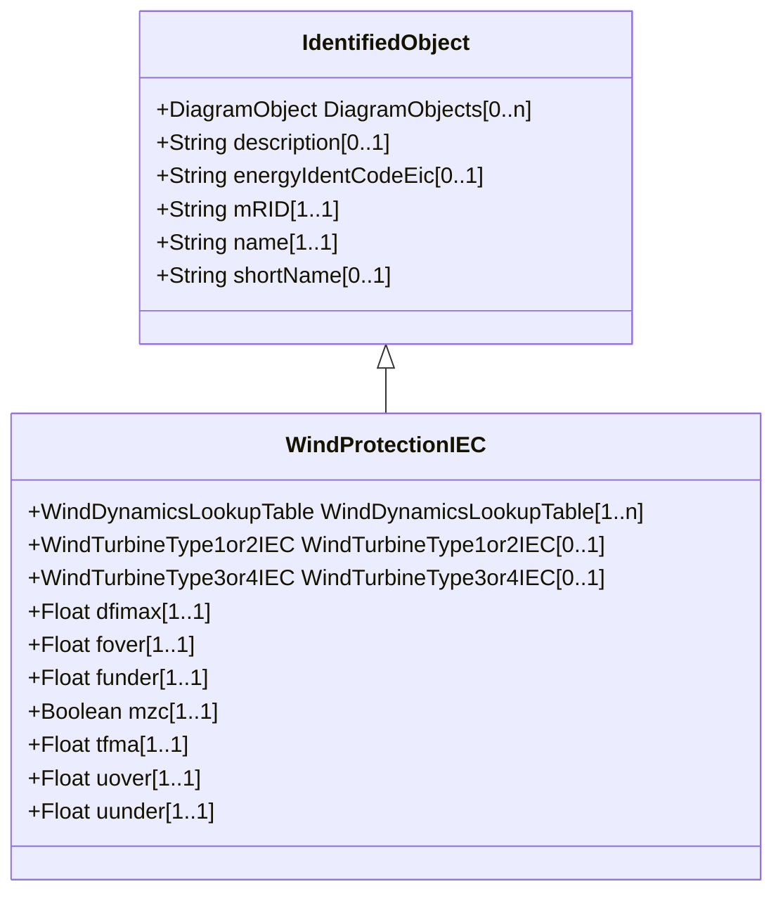

# WindProtectionIEC

The grid protection model includes protection against over- and under-voltage, and against over- and under-frequency. Reference: IEC 61400-27-1:2015, 5.6.6.

## Inheritance

<button class="mermaid-enlarge-button">Enlarge Diagram</button>

## Attributes

| Label | Type | Multiplicity | Comment |
|-------|------|--------------|---------|
| WindDynamicsLookupTable | [WindDynamicsLookupTable](WindDynamicsLookupTable.md) | 1..n | The wind dynamics lookup table associated with this grid protection model. |
| WindTurbineType1or2IEC | [WindTurbineType1or2IEC](WindTurbineType1or2IEC.md) | 0..1 | Wind generator type 1 or type 2 model with which this wind turbine protection model is associated. |
| WindTurbineType3or4IEC | [WindTurbineType3or4IEC](WindTurbineType3or4IEC.md) | 0..1 | Wind generator type 3 or type 4 model with which this wind turbine protection model is associated. |
| dfimax | Float | 1..1 | Maximum rate of change of frequency (dFmax). It is a type-dependent parameter. |
| fover | Float | 1..1 | Wind turbine over frequency protection activation threshold (fover). It is a project-dependent parameter. |
| funder | Float | 1..1 | Wind turbine under frequency protection activation threshold (funder). It is a project-dependent parameter. |
| mzc | Boolean | 1..1 | Zero crossing measurement mode (Mzc). It is a type-dependent parameter. true = WT protection system uses zero crossings to detect frequency (1 in the IEC model) false = WT protection system does not use zero crossings to detect frequency (0 in the IEC model). |
| tfma | Float | 1..1 | Time interval of moving average window (TfMA) (>= 0). It is a type-dependent parameter. |
| uover | Float | 1..1 | Wind turbine over voltage protection activation threshold (uover). It is a project-dependent parameter. |
| uunder | Float | 1..1 | Wind turbine under voltage protection activation threshold (uunder). It is a project-dependent parameter. |

