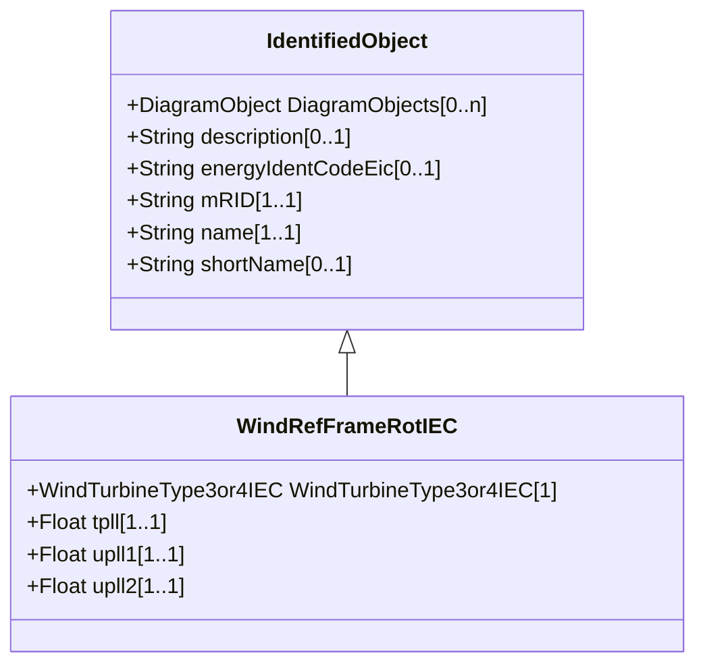

# WindRefFrameRotIEC

Reference frame rotation model. Reference: IEC 61400-27-1:2015, 5.6.3.5.

## Inheritance

<button class="mermaid-enlarge-button">Enlarge Diagram</button>

## Attributes

| Label | Type | Multiplicity | Comment |
|-------|------|--------------|---------|
| WindTurbineType3or4IEC | [WindTurbineType3or4IEC](WindTurbineType3or4IEC.md) | 1 | Wind turbine type 3 or type 4 model with which this reference frame rotation model is associated. |
| tpll | Float | 1..1 | Time constant for PLL first order filter model (TPLL) (>= 0). It is a type-dependent parameter. |
| upll1 | Float | 1..1 | Voltage below which the angle of the voltage is filtered and possibly also frozen (uPLL1). It is a type-dependent parameter. |
| upll2 | Float | 1..1 | Voltage (uPLL2) below which the angle of the voltage is frozen if uPLL2 is smaller or equal to uPLL1 . It is a type-dependent parameter. |

