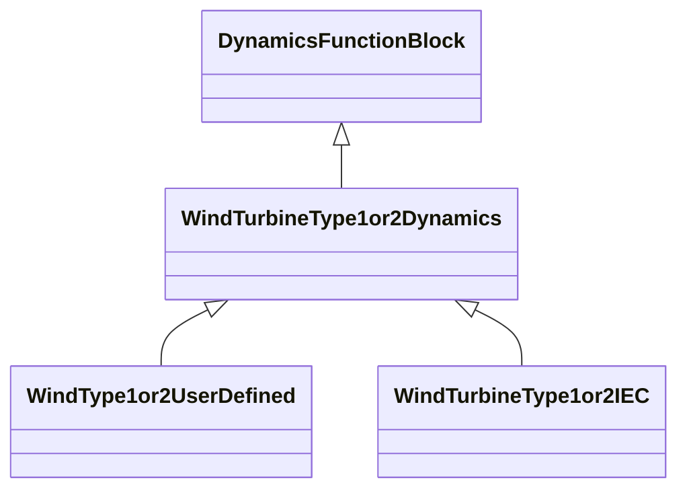

# WindTurbineType1or2Dynamics

Parent class supporting relationships to wind turbines type 1 and type 2 and their control models. Generator model for wind turbine of type 1 or type 2 is a standard asynchronous generator model.

## Inheritance

<button class="mermaid-enlarge-button">Enlarge Diagram</button>

## Attributes

| Label | Type | Multiplicity | Comment |
|-------|------|--------------|---------|
| AsynchronousMachineDynamics | [AsynchronousMachineDynamics](AsynchronousMachineDynamics.md) | 1 | Asynchronous machine model with which this wind generator type 1 or type 2 model is associated. |
| RemoteInputSignal | [RemoteInputSignal](RemoteInputSignal.md) | 0..1 | Remote input signal used by this wind generator type 1 or type 2 model. |

