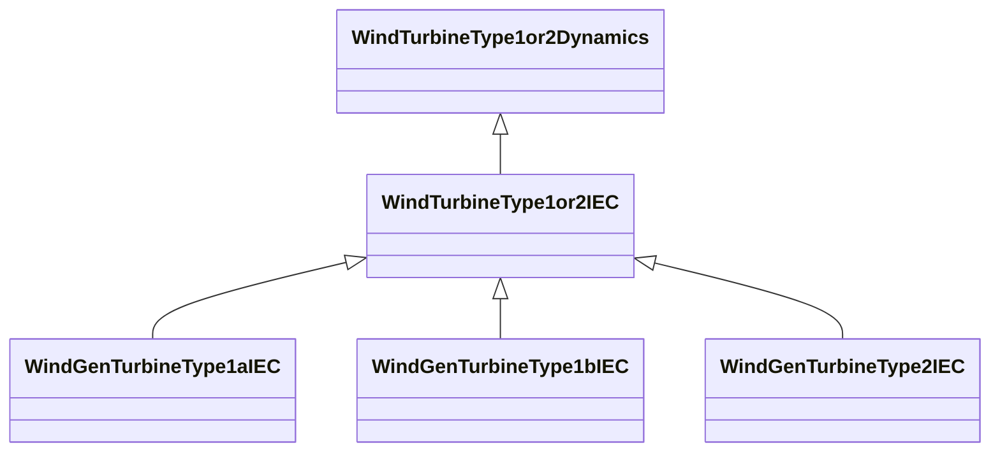

# WindTurbineType1or2IEC

Parent class supporting relationships to IEC wind turbines type 1 and type 2 including their control models. Generator model for wind turbine of IEC type 1 or type 2 is a standard asynchronous generator model. Reference: IEC 61400-27-1:2015, 5.5.2 and 5.5.3.

## Inheritance

<button class="mermaid-enlarge-button">Enlarge Diagram</button>

## Attributes

| Label | Type | Multiplicity | Comment |
|-------|------|--------------|---------|
| WindMechIEC | [WindMechIEC](WindMechIEC.md) | 1 | Wind mechanical model associated with this wind generator type 1 or type 2 model. |
| WindProtectionIEC | [WindProtectionIEC](WindProtectionIEC.md) | 1 | Wind turbune protection model associated with this wind generator type 1 or type 2 model. |

