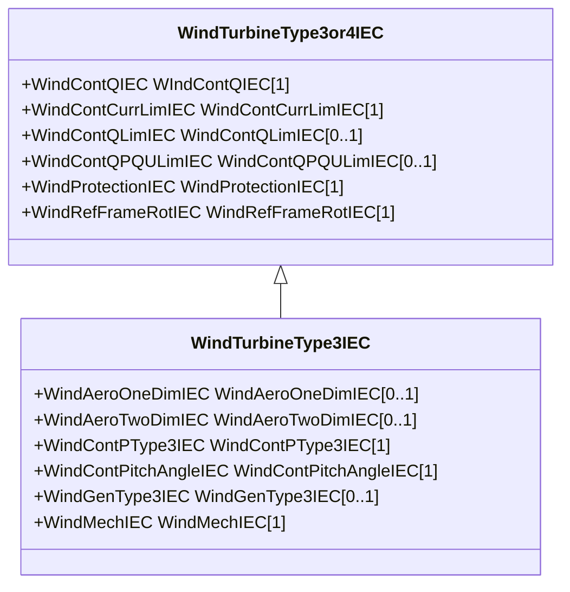

# WindTurbineType3IEC

Parent class supporting relationships to IEC wind turbines type 3 including their control models.

## Inheritance

<button class="mermaid-enlarge-button">Enlarge Diagram</button>

## Attributes

| Label | Type | Multiplicity | Comment |
|-------|------|--------------|---------|
| WindAeroOneDimIEC | [WindAeroOneDimIEC](WindAeroOneDimIEC.md) | 0..1 | Wind aerodynamic model associated with this wind generator type 3 model. |
| WindAeroTwoDimIEC | [WindAeroTwoDimIEC](WindAeroTwoDimIEC.md) | 0..1 | Wind aerodynamic model associated with this wind turbine type 3 model. |
| WindContPType3IEC | [WindContPType3IEC](WindContPType3IEC.md) | 1 | Wind control P type 3 model associated with this wind turbine type 3 model. |
| WindContPitchAngleIEC | [WindContPitchAngleIEC](WindContPitchAngleIEC.md) | 1 | Wind control pitch angle model associated with this wind turbine type 3. |
| WindGenType3IEC | [WindGenType3IEC](WindGenType3IEC.md) | 0..1 | Wind generator type 3 model associated with this wind turbine type 3 model. |
| WindMechIEC | [WindMechIEC](WindMechIEC.md) | 1 | Wind mechanical model associated with this wind turbine type 3 model. |

