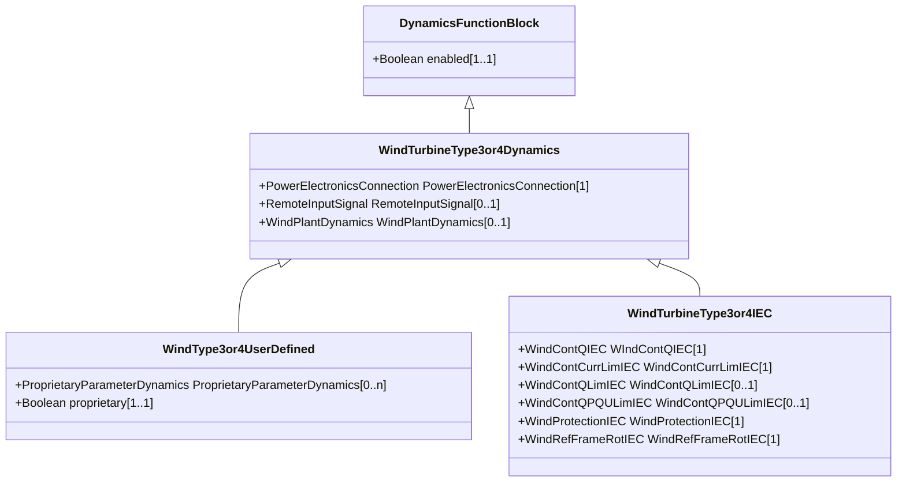

# WindTurbineType3or4Dynamics

Parent class supporting relationships to wind turbines type 3 and type 4 and wind plant including their control models.

## Inheritance

<button class="mermaid-enlarge-button">Enlarge Diagram</button>

## Attributes

| Label | Type | Multiplicity | Comment |
|-------|------|--------------|---------|
| PowerElectronicsConnection | [PowerElectronicsConnection](PowerElectronicsConnection.md) | 1 | The power electronics connection associated with this wind turbine type 3 or type 4 dynamics model. |
| RemoteInputSignal | [RemoteInputSignal](RemoteInputSignal.md) | 0..1 | Remote input signal used by these wind turbine type 3 or type 4 models. |
| WindPlantDynamics | [WindPlantDynamics](WindPlantDynamics.md) | 0..1 | The wind plant with which the wind turbines type 3 or type 4 are associated. |

