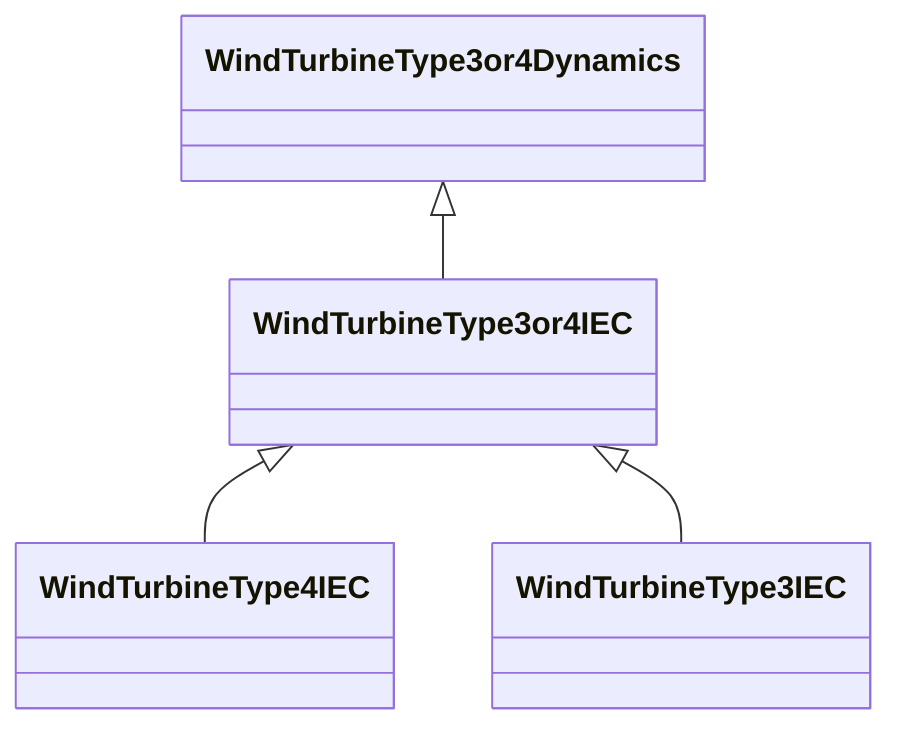

# WindTurbineType3or4IEC

Parent class supporting relationships to IEC wind turbines type 3 and type 4 including their control models.

## Inheritance

<button class="mermaid-enlarge-button">Enlarge Diagram</button>

## Attributes

| Label | Type | Multiplicity | Comment |
|-------|------|--------------|---------|
| WIndContQIEC | [WindContQIEC](WindContQIEC.md) | 1 | Wind control Q model associated with this wind turbine type 3 or type 4 model. |
| WindContCurrLimIEC | [WindContCurrLimIEC](WindContCurrLimIEC.md) | 1 | Wind control current limitation model associated with this wind turbine type 3 or type 4 model. |
| WindContQLimIEC | [WindContQLimIEC](WindContQLimIEC.md) | 0..1 | Constant Q limitation model associated with this wind generator type 3 or type 4 model. |
| WindContQPQULimIEC | [WindContQPQULimIEC](WindContQPQULimIEC.md) | 0..1 | QP and QU limitation model associated with this wind generator type 3 or type 4 model. |
| WindProtectionIEC | [WindProtectionIEC](WindProtectionIEC.md) | 1 | Wind turbune protection model associated with this wind generator type 3 or type 4 model. |
| WindRefFrameRotIEC | [WindRefFrameRotIEC](WindRefFrameRotIEC.md) | 1 | Reference frame rotation model associated with this wind turbine type 3 or type 4 model. |

