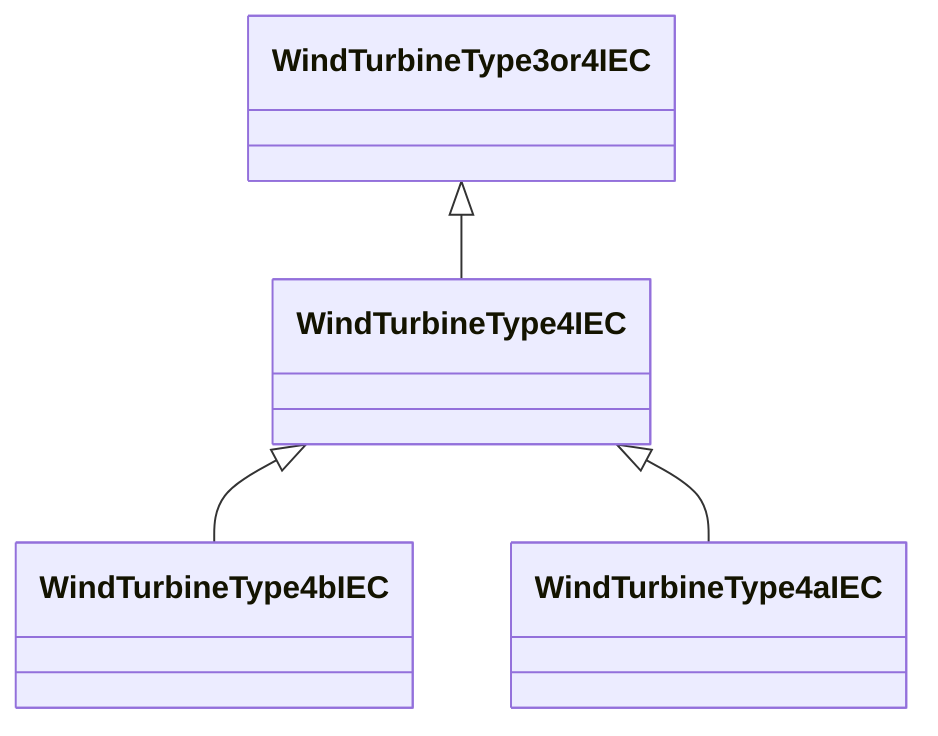

# WindTurbineType4IEC

Parent class supporting relationships to IEC wind turbines type 4 including their control models.

## Inheritance

<button class="mermaid-enlarge-button">Enlarge Diagram</button>

## Attributes

| Label | Type | Multiplicity | Comment |
|-------|------|--------------|---------|
| WindGenType3aIEC | [WindGenType3aIEC](WindGenType3aIEC.md) | 0..1 | Wind generator type 3A model associated with this wind turbine type 4 model. |

