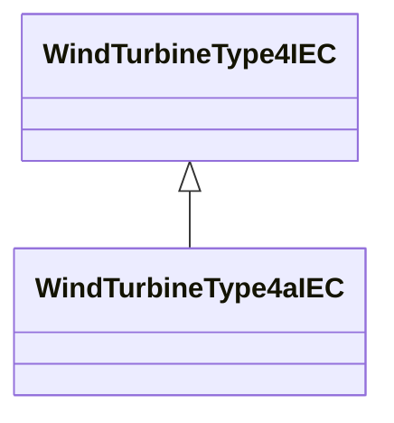

# WindTurbineType4aIEC

Wind turbine IEC type 4A. Reference: IEC 61400-27-1:2015, 5.5.5.2.

## Inheritance

<button class="mermaid-enlarge-button">Enlarge Diagram</button>

## Attributes

| Label | Type | Multiplicity | Comment |
|-------|------|--------------|---------|
| WindContPType4aIEC | [WindContPType4aIEC](WindContPType4aIEC.md) | 1 | Wind control P type 4A model associated with this wind turbine type 4A model. |
| WindGenType4IEC | [WindGenType4IEC](WindGenType4IEC.md) | 0..1 | Wind generator type 4 model associated with this wind turbine type 4A model. |

