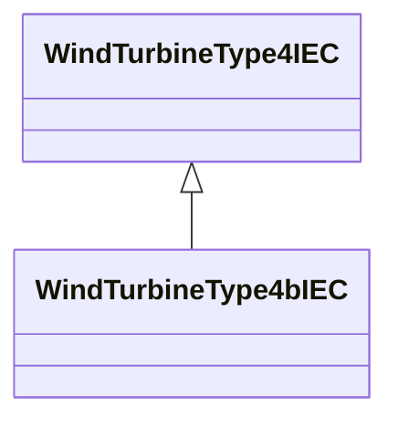

# WindTurbineType4bIEC

Wind turbine IEC type 4B. Reference: IEC 61400-27-1:2015, 5.5.5.3.

## Inheritance

<button class="mermaid-enlarge-button">Enlarge Diagram</button>

## Attributes

| Label | Type | Multiplicity | Comment |
|-------|------|--------------|---------|
| WindContPType4bIEC | [WindContPType4bIEC](WindContPType4bIEC.md) | 1 | Wind control P type 4B model associated with this wind turbine type 4B model. |
| WindGenType4IEC | [WindGenType4IEC](WindGenType4IEC.md) | 0..1 | Wind generator type 4 model associated with this wind turbine type 4B model. |
| WindMechIEC | [WindMechIEC](WindMechIEC.md) | 1 | Wind mechanical model associated with this wind turbine type 4B model. |

