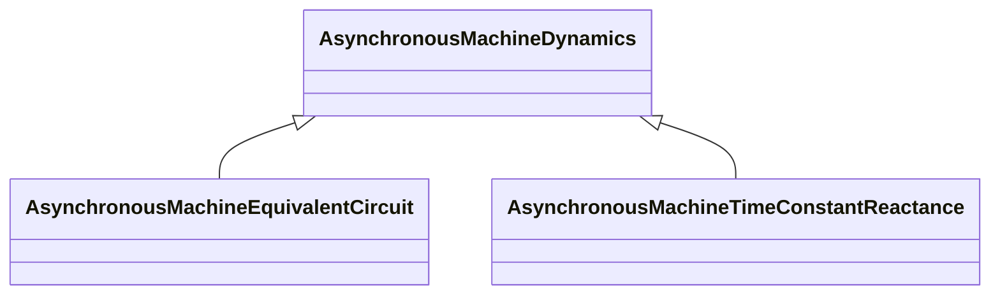

# Package_AsynchronousMachineDynamics

## Overview Diagram

<button class="mermaid-enlarge-button">Enlarge Diagram</button>

## Classes

- [AsynchronousMachineDynamics](../Classes/AsynchronousMachineDynamics): Asynchronous machine whose behaviour is described by reference to a standard model expressed in either time constant reactance form or equivalent circuit form or by definition of a user-defined model.
- [AsynchronousMachineEquivalentCircuit](../Classes/AsynchronousMachineEquivalentCircuit): The electrical equations of all variations of the asynchronous model are based on the AsynchronousEquivalentCircuit diagram for the direct- and quadrature- axes, with two equivalent rotor windings in each axis.
- [AsynchronousMachineTimeConstantReactance](../Classes/AsynchronousMachineTimeConstantReactance): Parameter details: If X'' = X', a single cage (one equivalent rotor winding per axis) is modelled.
