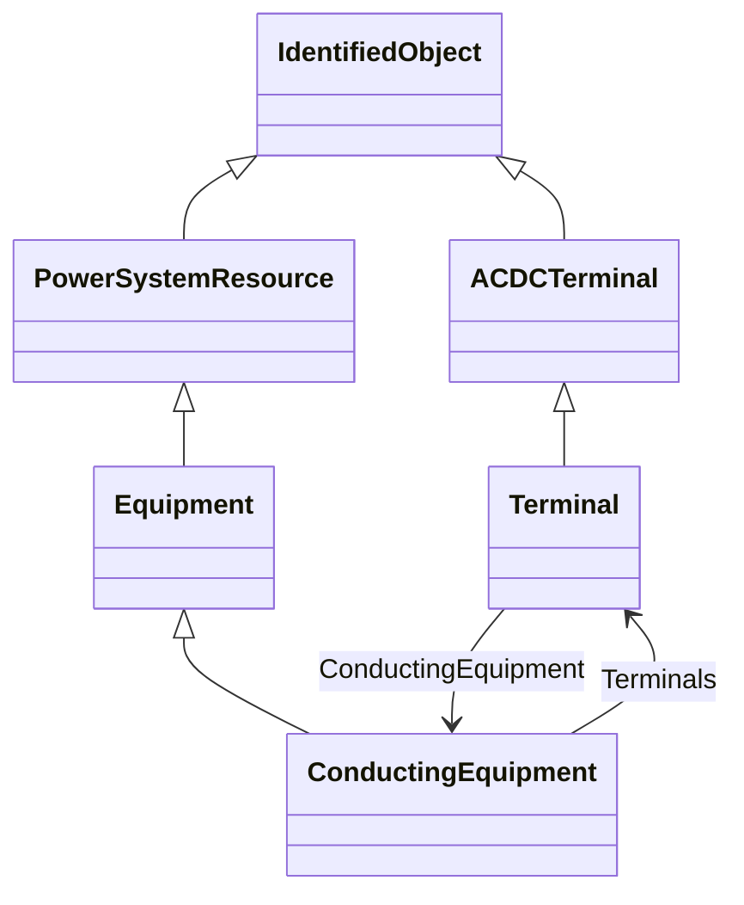

# Package_Core

## Overview Diagram

<button class="mermaid-enlarge-button">Enlarge Diagram</button>

## Classes

- [ACDCTerminal](../Classes/ACDCTerminal): An electrical connection point (AC or DC) to a piece of conducting equipment.
- [ConductingEquipment](../Classes/ConductingEquipment): The parts of the AC power system that are designed to carry current or that are conductively connected through terminals.
- [Equipment](../Classes/Equipment): The parts of a power system that are physical devices, electronic or mechanical.
- [IdentifiedObject](../Classes/IdentifiedObject): This is a root class to provide common identification for all classes needing identification and naming attributes.
- [PowerSystemResource](../Classes/PowerSystemResource): A power system resource (PSR) can be an item of equipment such as a switch, an equipment container containing many individual items of equipment such as a substation, or an organisational entity such as sub-control area.
- [Terminal](../Classes/Terminal): An AC electrical connection point to a piece of conducting equipment.
