# Package_CoreEquipmentProfile

## Overview Diagram

```mermaid
classDiagram
    IdentifiedObject <|-- FossilFuel
    FossilFuel --> ThermalGeneratingUnit : ThermalGeneratingUnit
    ACDCTerminal <|-- Terminal
    Terminal --> AuxiliaryEquipment : AuxiliaryEquipment
    Terminal --> ConductingEquipment : ConductingEquipment
    Terminal --> ConnectivityNode : ConnectivityNode
    Terminal --> ACDCConverter : ConverterDCSides
    Terminal --> RegulatingControl : RegulatingControl
    Terminal --> TieFlow : TieFlow
    Terminal --> TransformerEnd : TransformerEnd
    Equipment <|-- PowerElectronicsUnit
    PowerElectronicsUnit --> PowerElectronicsConnection : PowerElectronicsConnection
    ConductingEquipment <|-- PowerTransformer
    PowerTransformer --> PowerTransformerEnd : PowerTransformerEnd
    ACDCConverter <|-- VsConverter
    VsConverter --> VsCapabilityCurve : CapabilityCurve
    IdentifiedObject <|-- PhaseTapChangerTable
    PhaseTapChangerTable --> PhaseTapChangerTablePoint : PhaseTapChangerTablePoint
    PhaseTapChangerTable --> PhaseTapChangerTabular : PhaseTapChangerTabular
    EquivalentEquipment <|-- EquivalentInjection
    EquivalentInjection --> ReactiveCapabilityCurve : ReactiveCapabilityCurve
    OperationalLimit <|-- ActivePowerLimit
    ProtectedSwitch <|-- Breaker
    PhaseTapChanger <|-- PhaseTapChangerLinear
    AuxiliaryEquipment <|-- SurgeArrester
    Sensor <|-- CurrentTransformer
    PowerSystemResource <|-- RegulatingControl
    RegulatingControl --> RegulatingCondEq : RegulatingCondEq
    RegulatingControl --> RegulationSchedule : RegulationSchedule
    RegulatingControl --> Terminal : Terminal
    PhaseTapChanger <|-- PhaseTapChangerTabular
    PhaseTapChangerTabular --> PhaseTapChangerTable : PhaseTapChangerTable
    PowerSystemResource <|-- CombinedCyclePlant
    CombinedCyclePlant --> ThermalGeneratingUnit : ThermalGeneratingUnits
    DCConductingEquipment <|-- DCSwitch
    ConductingEquipment <|-- Conductor
    PowerSystemResource <|-- TapChanger
    TapChanger --> TapChangerControl : TapChangerControl
    TapChanger --> TapSchedule : TapSchedules
    OperationalLimit <|-- ApparentPowerLimit
    GeneratingUnit <|-- ThermalGeneratingUnit
    ThermalGeneratingUnit --> CAESPlant : CAESPlant
    ThermalGeneratingUnit --> CogenerationPlant : CogenerationPlant
    ThermalGeneratingUnit --> CombinedCyclePlant : CombinedCyclePlant
    ThermalGeneratingUnit --> FossilFuel : FossilFuels
    IdentifiedObject <|-- RatioTapChangerTable
    RatioTapChangerTable --> RatioTapChanger : RatioTapChanger
    RatioTapChangerTable --> RatioTapChangerTablePoint : RatioTapChangerTablePoint
    RegularTimePoint --> RegularIntervalSchedule : IntervalSchedule
    PhaseTapChangerNonLinear <|-- PhaseTapChangerSymmetrical
    Conductor <|-- ACLineSegment
    ACLineSegment --> Clamp : Clamp
    ACLineSegment --> Cut : Cut
    IdentifiedObject <|-- OperationalLimitSet
    OperationalLimitSet --> Equipment : Equipment
    OperationalLimitSet --> OperationalLimit : OperationalLimitValue
    OperationalLimitSet --> ACDCTerminal : Terminal
    PowerSystemResource <|-- BoundaryPoint
    BoundaryPoint --> ConnectivityNode : ConnectivityNode
    TapChanger <|-- PhaseTapChanger
    PhaseTapChanger --> TransformerEnd : TransformerEnd
    RegulatingCondEq <|-- StaticVarCompensator
    EquipmentContainer <|-- VoltageLevel
    VoltageLevel --> BaseVoltage : BaseVoltage
    VoltageLevel --> Bay : Bays
    VoltageLevel --> Substation : Substation
    IdentifiedObject <|-- EnergySchedulingType
    EnergySchedulingType --> EnergySource : EnergySource
    PowerSystemResource <|-- Equipment
    Equipment --> EquipmentContainer : EquipmentContainer
    Equipment --> OperationalLimitSet : OperationalLimitSet
    DCBaseTerminal <|-- ACDCConverterDCTerminal
    ACDCConverterDCTerminal --> ACDCConverter : DCConductingEquipment
    DCSwitch <|-- DCDisconnector
    ConnectivityNodeContainer <|-- EquivalentNetwork
    EquivalentNetwork --> EquivalentEquipment : EquivalentEquipments
    RegulatingCondEq <|-- PowerElectronicsConnection
    PowerElectronicsConnection --> PowerElectronicsUnit : PowerElectronicsUnit
    LoadGroup <|-- NonConformLoadGroup
    NonConformLoadGroup --> NonConformLoad : EnergyConsumers
    NonConformLoadGroup --> NonConformLoadSchedule : NonConformLoadSchedules
    IdentifiedObject <|-- TransformerEnd
    TransformerEnd --> BaseVoltage : BaseVoltage
    TransformerEnd --> PhaseTapChanger : PhaseTapChanger
    TransformerEnd --> RatioTapChanger : RatioTapChanger
    TransformerEnd --> Terminal : Terminal
    DCBaseTerminal <|-- DCTerminal
    DCTerminal --> DCConductingEquipment : DCConductingEquipment
    RegulatingCondEq <|-- ShuntCompensator
    Sensor <|-- PostLineSensor
    SeasonDayTypeSchedule <|-- ConformLoadSchedule
    ConformLoadSchedule --> ConformLoadGroup : ConformLoadGroup
    ProtectedSwitch <|-- LoadBreakSwitch
    EnergyArea <|-- SubLoadArea
    SubLoadArea --> LoadArea : LoadArea
    SubLoadArea --> LoadGroup : LoadGroups
    TapChangerTablePoint <|-- PhaseTapChangerTablePoint
    PhaseTapChangerTablePoint --> PhaseTapChangerTable : PhaseTapChangerTable
    Equipment <|-- AuxiliaryEquipment
    AuxiliaryEquipment --> Terminal : Terminal
    Switch <|-- Fuse
    Switch <|-- Jumper
    PhaseTapChanger <|-- PhaseTapChangerNonLinear
    AuxiliaryEquipment <|-- Sensor
    DCConductingEquipment <|-- DCShunt
    TransformerEnd <|-- PowerTransformerEnd
    PowerTransformerEnd --> PowerTransformer : PowerTransformer
    Equipment <|-- GeneratingUnit
    GeneratingUnit --> ControlAreaGeneratingUnit : ControlAreaGeneratingUnit
    GeneratingUnit --> GrossToNetActivePowerCurve : GrossToNetActivePowerCurves
    GeneratingUnit --> RotatingMachine : RotatingMachine
    DCConductingEquipment <|-- DCSeriesDevice
    Breaker <|-- DisconnectingCircuitBreaker
    EarthFaultCompensator <|-- PetersenCoil
    EnergyConnection <|-- RegulatingCondEq
    RegulatingCondEq --> RegulatingControl : RegulatingControl
    Switch <|-- ProtectedSwitch
    IdentifiedObject <|-- PowerSystemResource
    IdentifiedObject <|-- BaseVoltage
    BaseVoltage --> ConductingEquipment : ConductingEquipment
    BaseVoltage --> TransformerEnd : TransformerEnds
    BaseVoltage --> VoltageLevel : VoltageLevel
    EnergyConnection <|-- EnergySource
    EnergySource --> EnergySchedulingType : EnergySchedulingType
    PowerSystemResource <|-- CAESPlant
    CAESPlant --> ThermalGeneratingUnit : ThermalGeneratingUnit
    AuxiliaryEquipment <|-- WaveTrap
    PowerSystemResource <|-- ControlArea
    ControlArea --> ControlAreaGeneratingUnit : ControlAreaGeneratingUnit
    ControlArea --> EnergyArea : EnergyArea
    ControlArea --> TieFlow : TieFlow
    SeasonDayTypeSchedule <|-- TapSchedule
    TapSchedule --> TapChanger : TapChanger
    IdentifiedObject <|-- LoadGroup
    LoadGroup --> SubLoadArea : SubLoadArea
    EquivalentEquipment <|-- EquivalentShunt
    ConductingEquipment <|-- EnergyConnection
    IdentifiedObject <|-- Season
    Season --> SeasonDayTypeSchedule : SeasonDayTypeSchedules
    GeneratingUnit <|-- NuclearGeneratingUnit
    PowerSystemResource <|-- CogenerationPlant
    CogenerationPlant --> ThermalGeneratingUnit : ThermalGeneratingUnits
    GeneratingUnit <|-- HydroGeneratingUnit
    HydroGeneratingUnit --> HydroPowerPlant : HydroPowerPlant
    IdentifiedObject <|-- ACDCTerminal
    ACDCTerminal --> BusNameMarker : BusNameMarker
    ACDCTerminal --> OperationalLimitSet : OperationalLimitSet
    PowerSystemResource <|-- SolarPowerPlant
    SolarPowerPlant --> SolarGeneratingUnit : SolarGeneratingUnits
    Curve <|-- GrossToNetActivePowerCurve
    GrossToNetActivePowerCurve --> GeneratingUnit : GeneratingUnit
    ConductingEquipment <|-- ACDCConverter
    ACDCConverter --> ACDCConverterDCTerminal : DCTerminals
    ACDCConverter --> Terminal : PccTerminal
    EnergyConsumer <|-- ConformLoad
    ConformLoad --> ConformLoadGroup : LoadGroup
    RegularIntervalSchedule <|-- SeasonDayTypeSchedule
    SeasonDayTypeSchedule --> DayType : DayType
    SeasonDayTypeSchedule --> Season : Season
    Equipment <|-- DCConductingEquipment
    DCConductingEquipment --> DCTerminal : DCTerminals
    IdentifiedObject <|-- LoadResponseCharacteristic
    LoadResponseCharacteristic --> EnergyConsumer : EnergyConsumer
    IdentifiedObject <|-- EnergyArea
    EnergyArea --> ControlArea : ControlArea
    EnergyConsumer <|-- StationSupply
    Connector <|-- BusbarSection
    SeasonDayTypeSchedule <|-- SwitchSchedule
    SwitchSchedule --> Switch : Switch
    EnergyConnection <|-- EnergyConsumer
    EnergyConsumer --> LoadResponseCharacteristic : LoadResponse
    IdentifiedObject <|-- BusNameMarker
    BusNameMarker --> ReportingGroup : ReportingGroup
    BusNameMarker --> ACDCTerminal : Terminal
    ConductingEquipment <|-- EquivalentEquipment
    EquivalentEquipment --> EquivalentNetwork : EquivalentNetwork
    Sensor <|-- PotentialTransformer
    SeasonDayTypeSchedule <|-- NonConformLoadSchedule
    NonConformLoadSchedule --> NonConformLoadGroup : NonConformLoadGroup
    RotatingMachine <|-- AsynchronousMachine
    DCEquipmentContainer <|-- DCLine
    DCLine --> SubGeographicalRegion : Region
    PowerSystemResource <|-- ConnectivityNodeContainer
    ConnectivityNodeContainer --> ConnectivityNode : ConnectivityNodes
    IdentifiedObject <|-- ReportingGroup
    ReportingGroup --> BusNameMarker : BusNameMarker
    DCConductingEquipment <|-- DCChopper
    EquivalentEquipment <|-- EquivalentBranch
    Curve <|-- VsCapabilityCurve
    VsCapabilityCurve --> VsConverter : VsConverterDCSides
    EquipmentContainer <|-- DCEquipmentContainer
    DCEquipmentContainer --> DCNode : DCNodes
    DCEquipmentContainer <|-- DCConverterUnit
    DCConverterUnit --> Substation : Substation
    Equipment <|-- HydroPump
    HydroPump --> HydroPowerPlant : HydroPowerPlant
    HydroPump --> RotatingMachine : RotatingMachine
    AuxiliaryEquipment <|-- FaultIndicator
    PowerElectronicsUnit <|-- PowerElectronicsWindUnit
    EquipmentContainer <|-- Line
    Line --> SubGeographicalRegion : Region
    IdentifiedObject <|-- ControlAreaGeneratingUnit
    ControlAreaGeneratingUnit --> ControlArea : ControlArea
    ControlAreaGeneratingUnit --> GeneratingUnit : GeneratingUnit
    IdentifiedObject <|-- DCNode
    DCNode --> DCEquipmentContainer : DCEquipmentContainer
    DCNode --> DCBaseTerminal : DCTerminals
    TapChanger <|-- RatioTapChanger
    RatioTapChanger --> RatioTapChangerTable : RatioTapChangerTable
    RatioTapChanger --> TransformerEnd : TransformerEnd
    ACDCConverter <|-- CsConverter
    PowerElectronicsUnit <|-- PhotoVoltaicUnit
    RotatingMachine <|-- SynchronousMachine
    SynchronousMachine --> ReactiveCapabilityCurve : InitialReactiveCapabilityCurve
    LoadGroup <|-- ConformLoadGroup
    ConformLoadGroup --> ConformLoadSchedule : ConformLoadSchedules
    ConformLoadGroup --> ConformLoad : EnergyConsumers
    GeneratingUnit <|-- WindGeneratingUnit
    WindGeneratingUnit --> WindPowerPlant : WindPowerPlant
    ACDCTerminal <|-- DCBaseTerminal
    DCBaseTerminal --> DCNode : DCNode
    IdentifiedObject <|-- TieFlow
    TieFlow --> ControlArea : ControlArea
    TieFlow --> Terminal : Terminal
    EnergyConsumer <|-- NonConformLoad
    NonConformLoad --> NonConformLoadGroup : LoadGroup
    RegulatingControl <|-- TapChangerControl
    TapChangerControl --> TapChanger : TapChanger
    Switch <|-- Cut
    Cut --> ACLineSegment : ACLineSegment
    IdentifiedObject <|-- Curve
    Curve --> CurveData : CurveDatas
    ShuntCompensator <|-- LinearShuntCompensator
    IdentifiedObject <|-- ConnectivityNode
    ConnectivityNode --> BoundaryPoint : BoundaryPoint
    ConnectivityNode --> ConnectivityNodeContainer : ConnectivityNodeContainer
    ConnectivityNode --> Terminal : Terminals
    PowerSystemResource <|-- HydroPowerPlant
    HydroPowerPlant --> HydroGeneratingUnit : HydroGeneratingUnits
    HydroPowerPlant --> HydroPump : HydroPumps
    ConductingEquipment <|-- Connector
    PowerSystemResource <|-- WindPowerPlant
    WindPowerPlant --> WindGeneratingUnit : WindGeneratingUnits
    RegulatingCondEq <|-- ExternalNetworkInjection
    ConnectivityNodeContainer <|-- EquipmentContainer
    EquipmentContainer --> Equipment : Equipments
    Curve <|-- ReactiveCapabilityCurve
    ReactiveCapabilityCurve --> EquivalentInjection : EquivalentInjection
    ReactiveCapabilityCurve --> SynchronousMachine : InitiallyUsedBySynchronousMachines
    Switch <|-- Disconnector
    DCConductingEquipment <|-- DCLineSegment
    ConductingEquipment <|-- SeriesCompensator
    IdentifiedObject <|-- OperationalLimitType
    OperationalLimitType --> OperationalLimit : OperationalLimit
    ConductingEquipment <|-- EarthFaultCompensator
    GeneratingUnit <|-- SolarGeneratingUnit
    SolarGeneratingUnit --> SolarPowerPlant : SolarPowerPlant
    SeasonDayTypeSchedule <|-- RegulationSchedule
    RegulationSchedule --> RegulatingControl : RegulatingControl
    IdentifiedObject <|-- GeographicalRegion
    GeographicalRegion --> SubGeographicalRegion : Regions
    DCConductingEquipment <|-- DCBusbar
    IdentifiedObject <|-- DayType
    DayType --> SeasonDayTypeSchedule : SeasonDayTypeSchedules
    EquipmentContainer <|-- Bay
    Bay --> VoltageLevel : VoltageLevel
    TapChangerTablePoint <|-- RatioTapChangerTablePoint
    RatioTapChangerTablePoint --> RatioTapChangerTable : RatioTapChangerTable
    ConductingEquipment <|-- Clamp
    Clamp --> ACLineSegment : ACLineSegment
    Connector <|-- Junction
    RegulatingCondEq <|-- RotatingMachine
    RotatingMachine --> GeneratingUnit : GeneratingUnit
    RotatingMachine --> HydroPump : HydroPump
    CurveData --> Curve : Curve
    IdentifiedObject <|-- OperationalLimit
    OperationalLimit --> OperationalLimitSet : OperationalLimitSet
    OperationalLimit --> OperationalLimitType : OperationalLimitType
    ConductingEquipment <|-- Switch
    Switch --> SwitchSchedule : SwitchSchedules
    ShuntCompensator <|-- NonlinearShuntCompensator
    NonlinearShuntCompensator --> NonlinearShuntCompensatorPoint : NonlinearShuntCompensatorPoints
    PowerElectronicsUnit <|-- BatteryUnit
    NonlinearShuntCompensatorPoint --> NonlinearShuntCompensator : NonlinearShuntCompensator
    PhaseTapChangerNonLinear <|-- PhaseTapChangerAsymmetrical
    ConductingEquipment <|-- Ground
    EarthFaultCompensator <|-- GroundingImpedance
    OperationalLimit <|-- CurrentLimit
    EquipmentContainer <|-- Substation
    Substation --> DCConverterUnit : DCConverterUnit
    Substation --> SubGeographicalRegion : Region
    Substation --> VoltageLevel : VoltageLevels
    DCSwitch <|-- DCBreaker
    BasicIntervalSchedule <|-- RegularIntervalSchedule
    RegularIntervalSchedule --> RegularTimePoint : TimePoints
    OperationalLimit <|-- VoltageLimit
    IdentifiedObject <|-- SubGeographicalRegion
    SubGeographicalRegion --> DCLine : DCLines
    SubGeographicalRegion --> Line : Lines
    SubGeographicalRegion --> GeographicalRegion : Region
    SubGeographicalRegion --> Substation : Substations
    IdentifiedObject <|-- BasicIntervalSchedule
    Switch <|-- GroundDisconnector
    Equipment <|-- ConductingEquipment
    ConductingEquipment --> BaseVoltage : BaseVoltage
    ConductingEquipment --> Terminal : Terminals
    EnergyArea <|-- LoadArea
    LoadArea --> SubLoadArea : SubLoadAreas
    DCConductingEquipment <|-- DCGround
```

<button class="mermaid-enlarge-button">Enlarge Diagram</button>

## Classes

- [ACDCConverter](../Classes/ACDCConverter): A unit with valves for three phases, together with unit control equipment, essential protective and switching devices, DC storage capacitors, phase reactors and auxiliaries, if any, used for conversion.
- [ACDCConverterDCTerminal](../Classes/ACDCConverterDCTerminal): A DC electrical connection point at the AC/DC converter.
- [ACDCTerminal](../Classes/ACDCTerminal): An electrical connection point (AC or DC) to a piece of conducting equipment.
- [ACLineSegment](../Classes/ACLineSegment): A wire or combination of wires, with consistent electrical characteristics, building a single electrical system, used to carry alternating current between points in the power system.
- [ActivePowerLimit](../Classes/ActivePowerLimit): Limit on active power flow.
- [ApparentPowerLimit](../Classes/ApparentPowerLimit): Apparent power limit.
- [AsynchronousMachine](../Classes/AsynchronousMachine): A rotating machine whose shaft rotates asynchronously with the electrical field.
- [AuxiliaryEquipment](../Classes/AuxiliaryEquipment): AuxiliaryEquipment describe equipment that is not performing any primary functions but support for the equipment performing the primary function.
- [BaseVoltage](../Classes/BaseVoltage): Defines a system base voltage which is referenced.
- [BasicIntervalSchedule](../Classes/BasicIntervalSchedule): Schedule of values at points in time.
- [BatteryUnit](../Classes/BatteryUnit): An electrochemical energy storage device.
- [Bay](../Classes/Bay): A collection of power system resources (within a given substation) including conducting equipment, protection relays, measurements, and telemetry.
- [BoundaryPoint](../Classes/BoundaryPoint): Designates a connection point at which one or more model authority sets shall connect to.
- [Breaker](../Classes/Breaker): A mechanical switching device capable of making, carrying, and breaking currents under normal circuit conditions and also making, carrying for a specified time, and breaking currents under specified abnormal circuit conditions e.
- [BusNameMarker](../Classes/BusNameMarker): Used to apply user standard names to TopologicalNodes.
- [BusbarSection](../Classes/BusbarSection): A conductor, or group of conductors, with negligible impedance, that serve to connect other conducting equipment within a single substation.
- [CAESPlant](../Classes/CAESPlant): Compressed air energy storage plant.
- [Clamp](../Classes/Clamp): A Clamp is a galvanic connection at a line segment where other equipment is connected.
- [CogenerationPlant](../Classes/CogenerationPlant): A set of thermal generating units for the production of electrical energy and process steam (usually from the output of the steam turbines).
- [CombinedCyclePlant](../Classes/CombinedCyclePlant): A set of combustion turbines and steam turbines where the exhaust heat from the combustion turbines is recovered to make steam for the steam turbines, resulting in greater overall plant efficiency.
- [ConductingEquipment](../Classes/ConductingEquipment): The parts of the AC power system that are designed to carry current or that are conductively connected through terminals.
- [Conductor](../Classes/Conductor): Combination of conducting material with consistent electrical characteristics, building a single electrical system, used to carry current between points in the power system.
- [ConformLoad](../Classes/ConformLoad): ConformLoad represent loads that follow a daily load change pattern where the pattern can be used to scale the load with a system load.
- [ConformLoadGroup](../Classes/ConformLoadGroup): A group of loads conforming to an allocation pattern.
- [ConformLoadSchedule](../Classes/ConformLoadSchedule): A curve of load versus time (X-axis) showing the active power values (Y1-axis) and reactive power (Y2-axis) for each unit of the period covered.
- [ConnectivityNode](../Classes/ConnectivityNode): Connectivity nodes are points where terminals of AC conducting equipment are connected together with zero impedance.
- [ConnectivityNodeContainer](../Classes/ConnectivityNodeContainer): A base class for all objects that may contain connectivity nodes or topological nodes.
- [Connector](../Classes/Connector): A conductor, or group of conductors, with negligible impedance, that serve to connect other conducting equipment within a single substation and are modelled with a single logical terminal.
- [ControlArea](../Classes/ControlArea): A control area is a grouping of generating units and/or loads and a cutset of tie lines (as terminals) which may be used for a variety of purposes including automatic generation control, power flow solution area interchange control specification, and input to load forecasting.
- [ControlAreaGeneratingUnit](../Classes/ControlAreaGeneratingUnit): A control area generating unit.
- [CsConverter](../Classes/CsConverter): DC side of the current source converter (CSC).
- [CurrentLimit](../Classes/CurrentLimit): Operational limit on current.
- [CurrentTransformer](../Classes/CurrentTransformer): Instrument transformer used to measure electrical qualities of the circuit that is being protected and/or monitored.
- [Curve](../Classes/Curve): A multi-purpose curve or functional relationship between an independent variable (X-axis) and dependent (Y-axis) variables.
- [CurveData](../Classes/CurveData): Multi-purpose data points for defining a curve.
- [Cut](../Classes/Cut): A cut separates a line segment into two parts.
- [DCBaseTerminal](../Classes/DCBaseTerminal): An electrical connection point at a piece of DC conducting equipment.
- [DCBreaker](../Classes/DCBreaker): A breaker within a DC system.
- [DCBusbar](../Classes/DCBusbar): A busbar within a DC system.
- [DCChopper](../Classes/DCChopper): Low resistance equipment used in the internal DC circuit to balance voltages.
- [DCConductingEquipment](../Classes/DCConductingEquipment): The parts of the DC power system that are designed to carry current or that are conductively connected through DC terminals.
- [DCConverterUnit](../Classes/DCConverterUnit): Indivisible operative unit comprising all equipment between the point of common coupling on the AC side and the point of common coupling - DC side, essentially one or more converters, together with one or more converter transformers, converter control equipment, essential protective and switching devices and auxiliaries, if any, used for conversion.
- [DCDisconnector](../Classes/DCDisconnector): A disconnector within a DC system.
- [DCEquipmentContainer](../Classes/DCEquipmentContainer): A modelling construct to provide a root class for containment of DC as well as AC equipment.
- [DCGround](../Classes/DCGround): A ground within a DC system.
- [DCLine](../Classes/DCLine): Overhead lines and/or cables connecting two or more HVDC substations.
- [DCLineSegment](../Classes/DCLineSegment): A wire or combination of wires not insulated from one another, with consistent electrical characteristics, used to carry direct current between points in the DC region of the power system.
- [DCNode](../Classes/DCNode): DC nodes are points where terminals of DC conducting equipment are connected together with zero impedance.
- [DCSeriesDevice](../Classes/DCSeriesDevice): A series device within the DC system, typically a reactor used for filtering or smoothing.
- [DCShunt](../Classes/DCShunt): A shunt device within the DC system, typically used for filtering.
- [DCSwitch](../Classes/DCSwitch): A switch within the DC system.
- [DCTerminal](../Classes/DCTerminal): An electrical connection point to generic DC conducting equipment.
- [DayType](../Classes/DayType): Group of similar days.
- [DisconnectingCircuitBreaker](../Classes/DisconnectingCircuitBreaker): A circuit breaking device including disconnecting function, eliminating the need for separate disconnectors.
- [Disconnector](../Classes/Disconnector): A manually operated or motor operated mechanical switching device used for changing the connections in a circuit, or for isolating a circuit or equipment from a source of power.
- [EarthFaultCompensator](../Classes/EarthFaultCompensator): A conducting equipment used to represent a connection to ground which is typically used to compensate earth faults.
- [EnergyArea](../Classes/EnergyArea): Describes an area having energy production or consumption.
- [EnergyConnection](../Classes/EnergyConnection): A connection of energy generation or consumption on the power system model.
- [EnergyConsumer](../Classes/EnergyConsumer): Generic user of energy - a point of consumption on the power system model.
- [EnergySchedulingType](../Classes/EnergySchedulingType): Used to define the type of generation for scheduling purposes.
- [EnergySource](../Classes/EnergySource): A generic equivalent for an energy supplier on a transmission or distribution voltage level.
- [Equipment](../Classes/Equipment): The parts of a power system that are physical devices, electronic or mechanical.
- [EquipmentContainer](../Classes/EquipmentContainer): A modelling construct to provide a root class for containing equipment.
- [EquivalentBranch](../Classes/EquivalentBranch): The class represents equivalent branches.
- [EquivalentEquipment](../Classes/EquivalentEquipment): The class represents equivalent objects that are the result of a network reduction.
- [EquivalentInjection](../Classes/EquivalentInjection): This class represents equivalent injections (generation or load).
- [EquivalentNetwork](../Classes/EquivalentNetwork): A class that groups electrical equivalents, including internal nodes, of a network that has been reduced.
- [EquivalentShunt](../Classes/EquivalentShunt): The class represents equivalent shunts.
- [ExternalNetworkInjection](../Classes/ExternalNetworkInjection): This class represents the external network and it is used for IEC 60909 calculations.
- [FaultIndicator](../Classes/FaultIndicator): A FaultIndicator is typically only an indicator (which may or may not be remotely monitored), and not a piece of equipment that actually initiates a protection event.
- [FossilFuel](../Classes/FossilFuel): The fossil fuel consumed by the non-nuclear thermal generating unit.
- [Fuse](../Classes/Fuse): An overcurrent protective device with a circuit opening fusible part that is heated and severed by the passage of overcurrent through it.
- [GeneratingUnit](../Classes/GeneratingUnit): A single or set of synchronous machines for converting mechanical power into alternating-current power.
- [GeographicalRegion](../Classes/GeographicalRegion): A geographical region of a power system network model.
- [GrossToNetActivePowerCurve](../Classes/GrossToNetActivePowerCurve): Relationship between the generating unit's gross active power output on the X-axis (measured at the terminals of the machine(s)) and the generating unit's net active power output on the Y-axis (based on utility-defined measurements at the power station).
- [Ground](../Classes/Ground): A point where the system is grounded used for connecting conducting equipment to ground.
- [GroundDisconnector](../Classes/GroundDisconnector): A manually operated or motor operated mechanical switching device used for isolating a circuit or equipment from ground.
- [GroundingImpedance](../Classes/GroundingImpedance): A fixed impedance device used for grounding.
- [HydroGeneratingUnit](../Classes/HydroGeneratingUnit): A generating unit whose prime mover is a hydraulic turbine (e.
- [HydroPowerPlant](../Classes/HydroPowerPlant): A hydro power station which can generate or pump.
- [HydroPump](../Classes/HydroPump): A synchronous motor-driven pump, typically associated with a pumped storage plant.
- [IdentifiedObject](../Classes/IdentifiedObject): This is a root class to provide common identification for all classes needing identification and naming attributes.
- [Jumper](../Classes/Jumper): A short section of conductor with negligible impedance which can be manually removed and replaced if the circuit is de-energized.
- [Junction](../Classes/Junction): A point where one or more conducting equipments are connected with zero resistance.
- [Line](../Classes/Line): Contains equipment beyond a substation belonging to a power transmission line.
- [LinearShuntCompensator](../Classes/LinearShuntCompensator): A linear shunt compensator has banks or sections with equal admittance values.
- [LoadArea](../Classes/LoadArea): The class is the root or first level in a hierarchical structure for grouping of loads for the purpose of load flow load scaling.
- [LoadBreakSwitch](../Classes/LoadBreakSwitch): A mechanical switching device capable of making, carrying, and breaking currents under normal operating conditions.
- [LoadGroup](../Classes/LoadGroup): The class is the third level in a hierarchical structure for grouping of loads for the purpose of load flow load scaling.
- [LoadResponseCharacteristic](../Classes/LoadResponseCharacteristic): Models the characteristic response of the load demand due to changes in system conditions such as voltage and frequency.
- [NonConformLoad](../Classes/NonConformLoad): NonConformLoad represents loads that do not follow a daily load change pattern and whose changes are not correlated with the daily load change pattern.
- [NonConformLoadGroup](../Classes/NonConformLoadGroup): Loads that do not follow a daily and seasonal load variation pattern.
- [NonConformLoadSchedule](../Classes/NonConformLoadSchedule): An active power (Y1-axis) and reactive power (Y2-axis) schedule (curves) versus time (X-axis) for non-conforming loads, e.
- [NonlinearShuntCompensator](../Classes/NonlinearShuntCompensator): A non linear shunt compensator has bank or section admittance values that differ.
- [NonlinearShuntCompensatorPoint](../Classes/NonlinearShuntCompensatorPoint): A non linear shunt compensator bank or section admittance value.
- [NuclearGeneratingUnit](../Classes/NuclearGeneratingUnit): A nuclear generating unit.
- [OperationalLimit](../Classes/OperationalLimit): A value and normal value associated with a specific kind of limit.
- [OperationalLimitSet](../Classes/OperationalLimitSet): A set of limits associated with equipment.
- [OperationalLimitType](../Classes/OperationalLimitType): The operational meaning of a category of limits.
- [PetersenCoil](../Classes/PetersenCoil): A variable impedance device normally used to offset line charging during single line faults in an ungrounded section of network.
- [PhaseTapChanger](../Classes/PhaseTapChanger): A transformer phase shifting tap model that controls the phase angle difference across the power transformer and potentially the active power flow through the power transformer.
- [PhaseTapChangerAsymmetrical](../Classes/PhaseTapChangerAsymmetrical): Describes the tap model for an asymmetrical phase shifting transformer in which the difference voltage vector adds to the in-phase winding.
- [PhaseTapChangerLinear](../Classes/PhaseTapChangerLinear): Describes a tap changer with a linear relation between the tap step and the phase angle difference across the transformer.
- [PhaseTapChangerNonLinear](../Classes/PhaseTapChangerNonLinear): The non-linear phase tap changer describes the non-linear behaviour of a phase tap changer.
- [PhaseTapChangerSymmetrical](../Classes/PhaseTapChangerSymmetrical): Describes a symmetrical phase shifting transformer tap model in which the voltage magnitude of both sides is the same.
- [PhaseTapChangerTable](../Classes/PhaseTapChangerTable): Describes a tabular curve for how the phase angle difference and impedance varies with the tap step.
- [PhaseTapChangerTablePoint](../Classes/PhaseTapChangerTablePoint): Describes each tap step in the phase tap changer tabular curve.
- [PhaseTapChangerTabular](../Classes/PhaseTapChangerTabular): Describes a tap changer with a table defining the relation between the tap step and the phase angle difference across the transformer.
- [PhotoVoltaicUnit](../Classes/PhotoVoltaicUnit): A photovoltaic device or an aggregation of such devices.
- [PostLineSensor](../Classes/PostLineSensor): A sensor used mainly in overhead distribution networks as the source of both current and voltage measurements.
- [PotentialTransformer](../Classes/PotentialTransformer): Instrument transformer (also known as Voltage Transformer) used to measure electrical qualities of the circuit that is being protected and/or monitored.
- [PowerElectronicsConnection](../Classes/PowerElectronicsConnection): A connection to the AC network for energy production or consumption that uses power electronics rather than rotating machines.
- [PowerElectronicsUnit](../Classes/PowerElectronicsUnit): A generating unit or battery or aggregation that connects to the AC network using power electronics rather than rotating machines.
- [PowerElectronicsWindUnit](../Classes/PowerElectronicsWindUnit): A wind generating unit that connects to the AC network with power electronics rather than rotating machines or an aggregation of such units.
- [PowerSystemResource](../Classes/PowerSystemResource): A power system resource (PSR) can be an item of equipment such as a switch, an equipment container containing many individual items of equipment such as a substation, or an organisational entity such as sub-control area.
- [PowerTransformer](../Classes/PowerTransformer): An electrical device consisting of two or more coupled windings, with or without a magnetic core, for introducing mutual coupling between electric circuits.
- [PowerTransformerEnd](../Classes/PowerTransformerEnd): A PowerTransformerEnd is associated with each Terminal of a PowerTransformer.
- [ProtectedSwitch](../Classes/ProtectedSwitch): A ProtectedSwitch is a switching device that can be operated by ProtectionEquipment.
- [RatioTapChanger](../Classes/RatioTapChanger): A tap changer that changes the voltage ratio impacting the voltage magnitude but not the phase angle across the transformer.
- [RatioTapChangerTable](../Classes/RatioTapChangerTable): Describes a curve for how the voltage magnitude and impedance varies with the tap step.
- [RatioTapChangerTablePoint](../Classes/RatioTapChangerTablePoint): Describes each tap step in the ratio tap changer tabular curve.
- [ReactiveCapabilityCurve](../Classes/ReactiveCapabilityCurve): Reactive power rating envelope versus the synchronous machine's active power, in both the generating and motoring modes.
- [RegularIntervalSchedule](../Classes/RegularIntervalSchedule): The schedule has time points where the time between them is constant.
- [RegularTimePoint](../Classes/RegularTimePoint): Time point for a schedule where the time between the consecutive points is constant.
- [RegulatingCondEq](../Classes/RegulatingCondEq): A type of conducting equipment that can regulate a quantity (i.
- [RegulatingControl](../Classes/RegulatingControl): Specifies a set of equipment that works together to control a power system quantity such as voltage or flow.
- [RegulationSchedule](../Classes/RegulationSchedule): A pre-established pattern over time for a controlled variable, e.
- [ReportingGroup](../Classes/ReportingGroup): A reporting group is used for various ad-hoc groupings used for reporting.
- [RotatingMachine](../Classes/RotatingMachine): A rotating machine which may be used as a generator or motor.
- [Season](../Classes/Season): A specified time period of the year.
- [SeasonDayTypeSchedule](../Classes/SeasonDayTypeSchedule): A time schedule covering a 24 hour period, with curve data for a specific type of season and day.
- [Sensor](../Classes/Sensor): This class describe devices that transform a measured quantity into signals that can be presented at displays, used in control or be recorded.
- [SeriesCompensator](../Classes/SeriesCompensator): A Series Compensator is a series capacitor or reactor or an AC transmission line without charging susceptance.
- [ShuntCompensator](../Classes/ShuntCompensator): A shunt capacitor or reactor or switchable bank of shunt capacitors or reactors.
- [SolarGeneratingUnit](../Classes/SolarGeneratingUnit): A solar thermal generating unit, connected to the grid by means of a rotating machine.
- [SolarPowerPlant](../Classes/SolarPowerPlant): Solar power plant.
- [StaticVarCompensator](../Classes/StaticVarCompensator): A facility for providing variable and controllable shunt reactive power.
- [StationSupply](../Classes/StationSupply): Station supply with load derived from the station output.
- [SubGeographicalRegion](../Classes/SubGeographicalRegion): A subset of a geographical region of a power system network model.
- [SubLoadArea](../Classes/SubLoadArea): The class is the second level in a hierarchical structure for grouping of loads for the purpose of load flow load scaling.
- [Substation](../Classes/Substation): A collection of equipment for purposes other than generation or utilization, through which electric energy in bulk is passed for the purposes of switching or modifying its characteristics.
- [SurgeArrester](../Classes/SurgeArrester): Shunt device, installed on the network, usually in the proximity of electrical equipment in order to protect the said equipment against transient voltage transients caused by lightning or switching activity.
- [Switch](../Classes/Switch): A generic device designed to close, or open, or both, one or more electric circuits.
- [SwitchSchedule](../Classes/SwitchSchedule): A schedule of switch positions.
- [SynchronousMachine](../Classes/SynchronousMachine): An electromechanical device that operates with shaft rotating synchronously with the network.
- [TapChanger](../Classes/TapChanger): Mechanism for changing transformer winding tap positions.
- [TapChangerControl](../Classes/TapChangerControl): Describes behaviour specific to tap changers, e.
- [TapChangerTablePoint](../Classes/TapChangerTablePoint): Describes each tap step in the tabular curve.
- [TapSchedule](../Classes/TapSchedule): A pre-established pattern over time for a tap step.
- [Terminal](../Classes/Terminal): An AC electrical connection point to a piece of conducting equipment.
- [ThermalGeneratingUnit](../Classes/ThermalGeneratingUnit): A generating unit whose prime mover could be a steam turbine, combustion turbine, or diesel engine.
- [TieFlow](../Classes/TieFlow): Defines the structure (in terms of location and direction) of the net interchange constraint for a control area.
- [TransformerEnd](../Classes/TransformerEnd): A conducting connection point of a power transformer.
- [VoltageLevel](../Classes/VoltageLevel): A collection of equipment at one common system voltage forming a switchgear.
- [VoltageLimit](../Classes/VoltageLimit): Operational limit applied to voltage.
- [VsCapabilityCurve](../Classes/VsCapabilityCurve): The P-Q capability curve for a voltage source converter, with P on X-axis and Qmin and Qmax on Y1-axis and Y2-axis.
- [VsConverter](../Classes/VsConverter): DC side of the voltage source converter (VSC).
- [WaveTrap](../Classes/WaveTrap): Line traps are devices that impede high frequency power line carrier signals yet present a negligible impedance at the main power frequency.
- [WindGeneratingUnit](../Classes/WindGeneratingUnit): A wind driven generating unit, connected to the grid by means of a rotating machine.
- [WindPowerPlant](../Classes/WindPowerPlant): Wind power plant.
