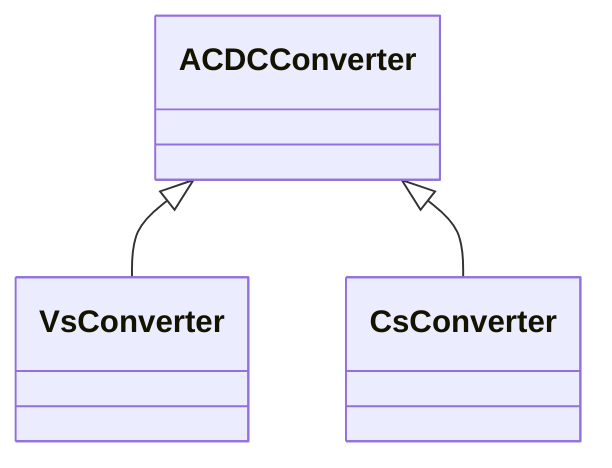

# Package_DC

## Overview Diagram

<button class="mermaid-enlarge-button">Enlarge Diagram</button>

## Classes

- [ACDCConverter](../Classes/ACDCConverter): A unit with valves for three phases, together with unit control equipment, essential protective and switching devices, DC storage capacitors, phase reactors and auxiliaries, if any, used for conversion.
- [CsConverter](../Classes/CsConverter): DC side of the current source converter (CSC).
- [VsConverter](../Classes/VsConverter): DC side of the voltage source converter (VSC).
