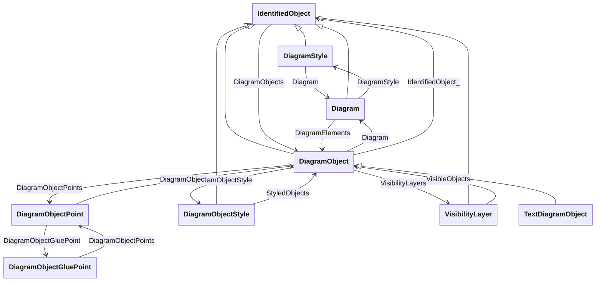

# Package_DiagramLayoutProfile

## Overview Diagram

<button class="mermaid-enlarge-button">Enlarge Diagram</button>

## Classes

- [Diagram](../Classes/Diagram): The diagram being exchanged.
- [DiagramObject](../Classes/DiagramObject): An object that defines one or more points in a given space.
- [DiagramObjectGluePoint](../Classes/DiagramObjectGluePoint): This is used for grouping diagram object points from different diagram objects that are considered to be glued together in a diagram even if they are not at the exact same coordinates.
- [DiagramObjectPoint](../Classes/DiagramObjectPoint): A point in a given space defined by 3 coordinates and associated to a diagram object.
- [DiagramObjectStyle](../Classes/DiagramObjectStyle): A reference to a style used by the originating system for a diagram object.
- [DiagramStyle](../Classes/DiagramStyle): The diagram style refers to a style used by the originating system for a diagram.
- [IdentifiedObject](../Classes/IdentifiedObject): This is a root class to provide common identification for all classes needing identification and naming attributes.
- [TextDiagramObject](../Classes/TextDiagramObject): A diagram object for placing free-text or text derived from an associated domain object.
- [VisibilityLayer](../Classes/VisibilityLayer): Layers are typically used for grouping diagram objects according to themes and scales.
