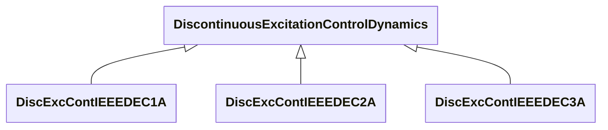

# Package_DiscontinuousExcitationControlDynamics

## Overview Diagram

<button class="mermaid-enlarge-button">Enlarge Diagram</button>

## Classes

- [DiscExcContIEEEDEC1A](../Classes/DiscExcContIEEEDEC1A): IEEE type DEC1A discontinuous excitation control model that boosts generator excitation to a level higher than that demanded by the voltage regulator and stabilizer immediately following a system fault.
- [DiscExcContIEEEDEC2A](../Classes/DiscExcContIEEEDEC2A): IEEE type DEC2A model for discontinuous excitation control.
- [DiscExcContIEEEDEC3A](../Classes/DiscExcContIEEEDEC3A): IEEE type DEC3A model.
- [DiscontinuousExcitationControlDynamics](../Classes/DiscontinuousExcitationControlDynamics): Discontinuous excitation control function block whose behaviour is described by reference to a standard model or by definition of a user-defined model.
