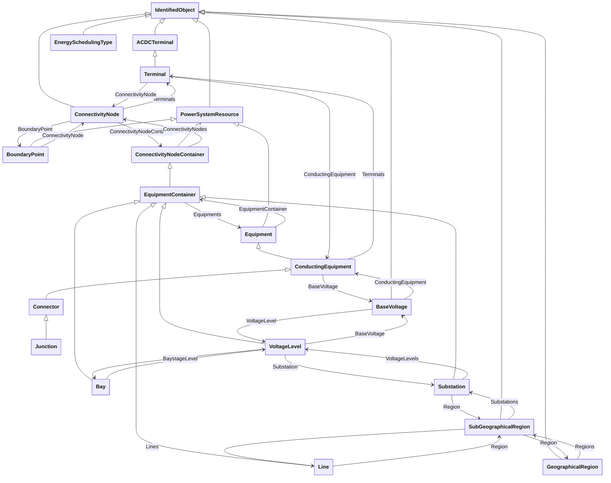

# Package_EquipmentBoundaryProfile

## Overview Diagram

<button class="mermaid-enlarge-button">Enlarge Diagram</button>

## Classes

- [ACDCTerminal](../Classes/ACDCTerminal): An electrical connection point (AC or DC) to a piece of conducting equipment.
- [BaseVoltage](../Classes/BaseVoltage): Defines a system base voltage which is referenced.
- [Bay](../Classes/Bay): A collection of power system resources (within a given substation) including conducting equipment, protection relays, measurements, and telemetry.
- [BoundaryPoint](../Classes/BoundaryPoint): Designates a connection point at which one or more model authority sets shall connect to.
- [ConductingEquipment](../Classes/ConductingEquipment): The parts of the AC power system that are designed to carry current or that are conductively connected through terminals.
- [ConnectivityNode](../Classes/ConnectivityNode): Connectivity nodes are points where terminals of AC conducting equipment are connected together with zero impedance.
- [ConnectivityNodeContainer](../Classes/ConnectivityNodeContainer): A base class for all objects that may contain connectivity nodes or topological nodes.
- [Connector](../Classes/Connector): A conductor, or group of conductors, with negligible impedance, that serve to connect other conducting equipment within a single substation and are modelled with a single logical terminal.
- [EnergySchedulingType](../Classes/EnergySchedulingType): Used to define the type of generation for scheduling purposes.
- [Equipment](../Classes/Equipment): The parts of a power system that are physical devices, electronic or mechanical.
- [EquipmentContainer](../Classes/EquipmentContainer): A modelling construct to provide a root class for containing equipment.
- [GeographicalRegion](../Classes/GeographicalRegion): A geographical region of a power system network model.
- [IdentifiedObject](../Classes/IdentifiedObject): This is a root class to provide common identification for all classes needing identification and naming attributes.
- [Junction](../Classes/Junction): A point where one or more conducting equipments are connected with zero resistance.
- [Line](../Classes/Line): Contains equipment beyond a substation belonging to a power transmission line.
- [PowerSystemResource](../Classes/PowerSystemResource): A power system resource (PSR) can be an item of equipment such as a switch, an equipment container containing many individual items of equipment such as a substation, or an organisational entity such as sub-control area.
- [SubGeographicalRegion](../Classes/SubGeographicalRegion): A subset of a geographical region of a power system network model.
- [Substation](../Classes/Substation): A collection of equipment for purposes other than generation or utilization, through which electric energy in bulk is passed for the purposes of switching or modifying its characteristics.
- [Terminal](../Classes/Terminal): An AC electrical connection point to a piece of conducting equipment.
- [VoltageLevel](../Classes/VoltageLevel): A collection of equipment at one common system voltage forming a switchgear.
