# Package_ExcitationSystemDynamics

## Overview Diagram

```mermaid
classDiagram
    ExcitationSystemDynamics <|-- ExcAVR4
    ExcitationSystemDynamics <|-- ExcAVR5
    ExcitationSystemDynamics <|-- ExcAC5A
    ExcitationSystemDynamics <|-- ExcAC8B
    ExcitationSystemDynamics <|-- ExcIEEEST1A
    ExcitationSystemDynamics <|-- ExcBBC
    ExcitationSystemDynamics <|-- ExcST2A
    ExcitationSystemDynamics <|-- ExcIEEEAC3A
    ExcitationSystemDynamics <|-- ExcCZ
    ExcitationSystemDynamics <|-- ExcANS
    ExcitationSystemDynamics <|-- ExcIEEEDC4B
    ExcitationSystemDynamics <|-- ExcAVR2
    ExcitationSystemDynamics <|-- ExcELIN1
    ExcitationSystemDynamics <|-- ExcSCRX
    ExcitationSystemDynamics <|-- ExcAC6A
    ExcitationSystemDynamics <|-- ExcIEEEDC1A
    ExcitationSystemDynamics <|-- ExcAC2A
    ExcitationSystemDynamics <|-- ExcDC2A
    ExcitationSystemDynamics <|-- ExcIEEEST4B
    ExcitationSystemDynamics <|-- ExcDC1A
    ExcitationSystemDynamics <|-- ExcAVR7
    ExcitationSystemDynamics <|-- ExcIEEEAC6A
    ExcitationSystemDynamics <|-- ExcST1A
    ExcitationSystemDynamics <|-- ExcST4B
    ExcitationSystemDynamics <|-- ExcELIN2
    ExcitationSystemDynamics <|-- ExcIEEEAC2A
    ExcitationSystemDynamics <|-- ExcIEEEAC4A
    ExcitationSystemDynamics <|-- ExcIEEEAC1A
    ExcitationSystemDynamics <|-- ExcSEXS
    ExcitationSystemDynamics <|-- ExcST6B
    ExcitationSystemDynamics <|-- ExcOEX3T
    ExcitationSystemDynamics <|-- ExcAVR1
    ExcitationSystemDynamics <|-- ExcIEEEST2A
    ExcitationSystemDynamics <|-- ExcAC1A
    ExcitationSystemDynamics <|-- ExcIEEEDC2A
    ExcitationSystemDynamics <|-- ExcIEEEST3A
    ExcitationSystemDynamics <|-- ExcST7B
    ExcitationSystemDynamics <|-- ExcDC3A
    ExcitationSystemDynamics <|-- ExcPIC
    ExcitationSystemDynamics <|-- ExcIEEEAC5A
    ExcitationSystemDynamics <|-- ExcREXS
    ExcitationSystemDynamics <|-- ExcIEEEDC3A
    ExcitationSystemDynamics <|-- ExcAC3A
    ExcitationSystemDynamics <|-- ExcAVR3
    ExcitationSystemDynamics <|-- ExcAC4A
    ExcitationSystemDynamics <|-- ExcIEEEST6B
    ExcitationSystemDynamics <|-- ExcSK
    ExcitationSystemDynamics <|-- ExcIEEEST7B
    ExcitationSystemDynamics <|-- ExcHU
    ExcitationSystemDynamics <|-- ExcST3A
    ExcitationSystemDynamics <|-- ExcDC3A1
    ExcitationSystemDynamics <|-- ExcIEEEAC7B
    ExcitationSystemDynamics <|-- ExcNI
    ExcitationSystemDynamics <|-- ExcIEEEST5B
    ExcitationSystemDynamics <|-- ExcRQB
    ExcitationSystemDynamics <|-- ExcIEEEAC8B
```

<button class="mermaid-enlarge-button">Enlarge Diagram</button>

## Classes

- [ExcAC1A](../Classes/ExcAC1A): Modified IEEE AC1A alternator-supplied rectifier excitation system with different rate feedback source.
- [ExcAC2A](../Classes/ExcAC2A): Modified IEEE AC2A alternator-supplied rectifier excitation system with different field current limit.
- [ExcAC3A](../Classes/ExcAC3A): Modified IEEE AC3A alternator-supplied rectifier excitation system with different field current limit.
- [ExcAC4A](../Classes/ExcAC4A): Modified IEEE AC4A alternator-supplied rectifier excitation system with different minimum controller output.
- [ExcAC5A](../Classes/ExcAC5A): Modified IEEE AC5A alternator-supplied rectifier excitation system with different minimum controller output.
- [ExcAC6A](../Classes/ExcAC6A): Modified IEEE AC6A alternator-supplied rectifier excitation system with speed input.
- [ExcAC8B](../Classes/ExcAC8B): Modified IEEE AC8B alternator-supplied rectifier excitation system with speed input and input limiter.
- [ExcANS](../Classes/ExcANS): Italian excitation system.
- [ExcAVR1](../Classes/ExcAVR1): Italian excitation system corresponding to IEEE (1968) type 1 model.
- [ExcAVR2](../Classes/ExcAVR2): Italian excitation system corresponding to IEEE (1968) type 2 model.
- [ExcAVR3](../Classes/ExcAVR3): Italian excitation system.
- [ExcAVR4](../Classes/ExcAVR4): Italian excitation system.
- [ExcAVR5](../Classes/ExcAVR5): Manual excitation control with field circuit resistance.
- [ExcAVR7](../Classes/ExcAVR7): IVO excitation system.
- [ExcBBC](../Classes/ExcBBC): Transformer fed static excitation system (static with ABB regulator).
- [ExcCZ](../Classes/ExcCZ): Czech proportion/integral exciter.
- [ExcDC1A](../Classes/ExcDC1A): Modified IEEE DC1A direct current commutator exciter with speed input and without underexcitation limiters (UEL) inputs.
- [ExcDC2A](../Classes/ExcDC2A): Modified IEEE DC2A direct current commutator exciter with speed input, one more leg block in feedback loop and without underexcitation limiters (UEL) inputs.
- [ExcDC3A](../Classes/ExcDC3A): Modified IEEE DC3A direct current commutator exciter with speed input, and deadband.
- [ExcDC3A1](../Classes/ExcDC3A1): Modified old IEEE type 3 excitation system.
- [ExcELIN1](../Classes/ExcELIN1): Static PI transformer fed excitation system ELIN (VATECH) - simplified model.
- [ExcELIN2](../Classes/ExcELIN2): Detailed excitation system ELIN (VATECH).
- [ExcHU](../Classes/ExcHU): Hungarian excitation system, with built-in voltage transducer.
- [ExcIEEEAC1A](../Classes/ExcIEEEAC1A): IEEE 421.
- [ExcIEEEAC2A](../Classes/ExcIEEEAC2A): IEEE 421.
- [ExcIEEEAC3A](../Classes/ExcIEEEAC3A): IEEE 421.
- [ExcIEEEAC4A](../Classes/ExcIEEEAC4A): IEEE 421.
- [ExcIEEEAC5A](../Classes/ExcIEEEAC5A): IEEE 421.
- [ExcIEEEAC6A](../Classes/ExcIEEEAC6A): IEEE 421.
- [ExcIEEEAC7B](../Classes/ExcIEEEAC7B): IEEE 421.
- [ExcIEEEAC8B](../Classes/ExcIEEEAC8B): IEEE 421.
- [ExcIEEEDC1A](../Classes/ExcIEEEDC1A): IEEE 421.
- [ExcIEEEDC2A](../Classes/ExcIEEEDC2A): IEEE 421.
- [ExcIEEEDC3A](../Classes/ExcIEEEDC3A): IEEE 421.
- [ExcIEEEDC4B](../Classes/ExcIEEEDC4B): IEEE 421.
- [ExcIEEEST1A](../Classes/ExcIEEEST1A): IEEE 421.
- [ExcIEEEST2A](../Classes/ExcIEEEST2A): IEEE 421.
- [ExcIEEEST3A](../Classes/ExcIEEEST3A): IEEE 421.
- [ExcIEEEST4B](../Classes/ExcIEEEST4B): IEEE 421.
- [ExcIEEEST5B](../Classes/ExcIEEEST5B): IEEE 421.
- [ExcIEEEST6B](../Classes/ExcIEEEST6B): IEEE 421.
- [ExcIEEEST7B](../Classes/ExcIEEEST7B): IEEE 421.
- [ExcNI](../Classes/ExcNI): Bus or solid fed SCR (silicon-controlled rectifier) bridge excitation system model type NI (NVE).
- [ExcOEX3T](../Classes/ExcOEX3T): Modified IEEE type ST1 excitation system with semi-continuous and acting terminal voltage limiter.
- [ExcPIC](../Classes/ExcPIC): Proportional/integral regulator excitation system.
- [ExcREXS](../Classes/ExcREXS): General purpose rotating excitation system.
- [ExcRQB](../Classes/ExcRQB): Excitation system type RQB (four-loop regulator, r?gulateur quatre boucles, developed in France) primarily used in nuclear or thermal generating units.
- [ExcSCRX](../Classes/ExcSCRX): Simple excitation system with generic characteristics typical of many excitation systems; intended for use where negative field current could be a problem.
- [ExcSEXS](../Classes/ExcSEXS): Simplified excitation system.
- [ExcSK](../Classes/ExcSK): Slovakian excitation system.
- [ExcST1A](../Classes/ExcST1A): Modification of an old IEEE ST1A static excitation system without overexcitation limiter (OEL) and underexcitation limiter (UEL).
- [ExcST2A](../Classes/ExcST2A): Modified IEEE ST2A static excitation system with another lead-lag block added to match the model defined by WECC.
- [ExcST3A](../Classes/ExcST3A): Modified IEEE ST3A static excitation system with added speed multiplier.
- [ExcST4B](../Classes/ExcST4B): Modified IEEE ST4B static excitation system with maximum inner loop feedback gain Vgmax.
- [ExcST6B](../Classes/ExcST6B): Modified IEEE ST6B static excitation system with PID controller and optional inner feedback loop.
- [ExcST7B](../Classes/ExcST7B): Modified IEEE ST7B static excitation system without stator current limiter (SCL) and current compensator (DROOP) inputs.
- [ExcitationSystemDynamics](../Classes/ExcitationSystemDynamics): Excitation system function block whose behaviour is described by reference to a standard model or by definition of a user-defined model.
