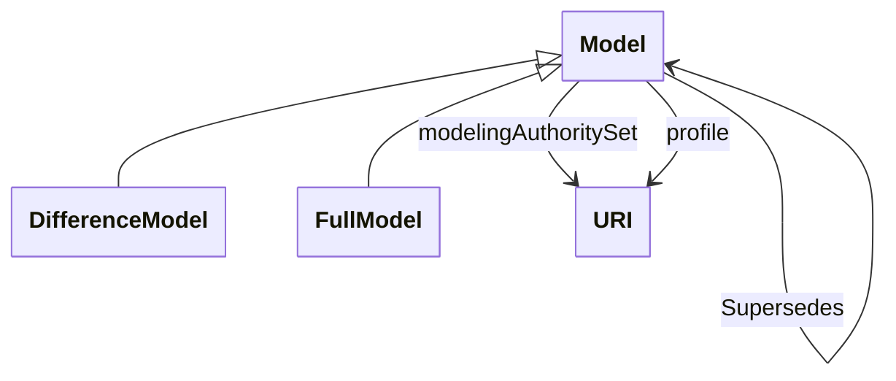

# Package_FileHeaderProfile

## Overview Diagram

<button class="mermaid-enlarge-button">Enlarge Diagram</button>

## Classes

- [DifferenceModel](../Classes/DifferenceModel): It represents the difference model header.
- [FullModel](../Classes/FullModel): It represents the full model header and its contents is described by the Model class.
- [Model](../Classes/Model): A Model is a collection of data describing instances, objects or entities, real or computed.
- [URI](../Classes/URI): URI is a string following the rules defined by the W3C/IETF URI Planning Interest Group in a set of RFCs of which one is RFC 3305.
