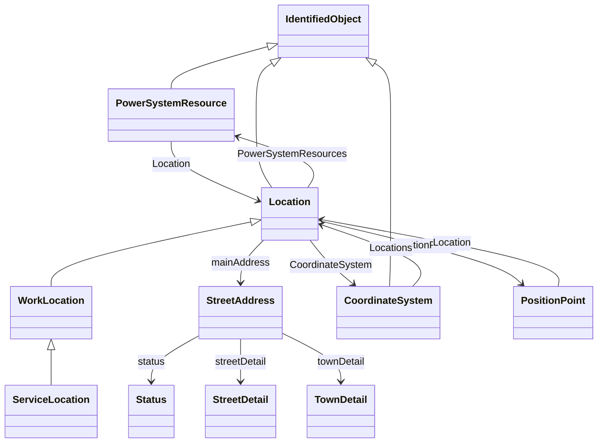

# Package_GeographicalLocationProfile

## Overview Diagram

<button class="mermaid-enlarge-button">Enlarge Diagram</button>

## Classes

- [CoordinateSystem](../Classes/CoordinateSystem): Coordinate reference system.
- [IdentifiedObject](../Classes/IdentifiedObject): This is a root class to provide common identification for all classes needing identification and naming attributes.
- [Location](../Classes/Location): The place, scene, or point of something where someone or something has been, is, and/or will be at a given moment in time.
- [PositionPoint](../Classes/PositionPoint): Set of spatial coordinates that determine a point, defined in the coordinate system specified in 'Location.
- [PowerSystemResource](../Classes/PowerSystemResource): A power system resource (PSR) can be an item of equipment such as a switch, an equipment container containing many individual items of equipment such as a substation, or an organisational entity such as sub-control area.
- [ServiceLocation](../Classes/ServiceLocation): A real estate location, commonly referred to as premises.
- [Status](../Classes/Status): Current status information relevant to an entity.
- [StreetAddress](../Classes/StreetAddress): General purpose street and postal address information.
- [StreetDetail](../Classes/StreetDetail): Street details, in the context of address.
- [TownDetail](../Classes/TownDetail): Town details, in the context of address.
- [WorkLocation](../Classes/WorkLocation): Information about a particular location for various forms of work.
