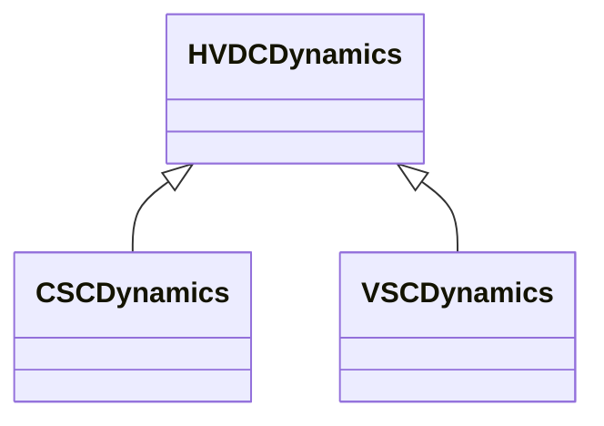

# Package_HVDCDynamics

## Overview Diagram

<button class="mermaid-enlarge-button">Enlarge Diagram</button>

## Classes

- [CSCDynamics](../Classes/CSCDynamics): CSC function block whose behaviour is described by reference to a standard model or by definition of a user-defined model.
- [HVDCDynamics](../Classes/HVDCDynamics): HVDC whose behaviour is described by reference to a standard model or by definition of a user-defined model.
- [VSCDynamics](../Classes/VSCDynamics): VSC function block whose behaviour is described by reference to a standard model or by definition of a user-defined model.
