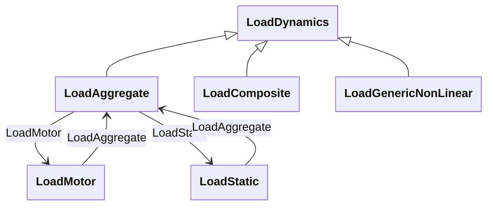

# Package_LoadDynamics

## Overview Diagram

<button class="mermaid-enlarge-button">Enlarge Diagram</button>

## Classes

- [LoadAggregate](../Classes/LoadAggregate): Aggregate loads are used to represent all or part of the real and reactive load from one or more loads in the static (power flow) data.
- [LoadComposite](../Classes/LoadComposite): Combined static load and induction motor load effects.
- [LoadDynamics](../Classes/LoadDynamics): Load whose behaviour is described by reference to a standard model or by definition of a user-defined model.
- [LoadGenericNonLinear](../Classes/LoadGenericNonLinear): Generic non-linear dynamic (GNLD) load.
- [LoadMotor](../Classes/LoadMotor): Aggregate induction motor load.
- [LoadStatic](../Classes/LoadStatic): General static load.
