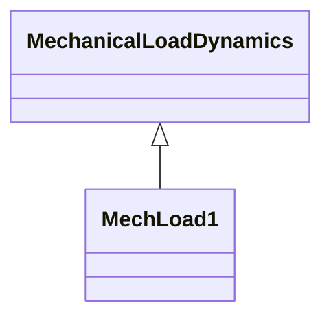

# Package_MechanicalLoadDynamics

## Overview Diagram

<button class="mermaid-enlarge-button">Enlarge Diagram</button>

## Classes

- [MechLoad1](../Classes/MechLoad1): Mechanical load model type 1.
- [MechanicalLoadDynamics](../Classes/MechanicalLoadDynamics): Mechanical load function block whose behaviour is described by reference to a standard model or by definition of a user-defined model.
