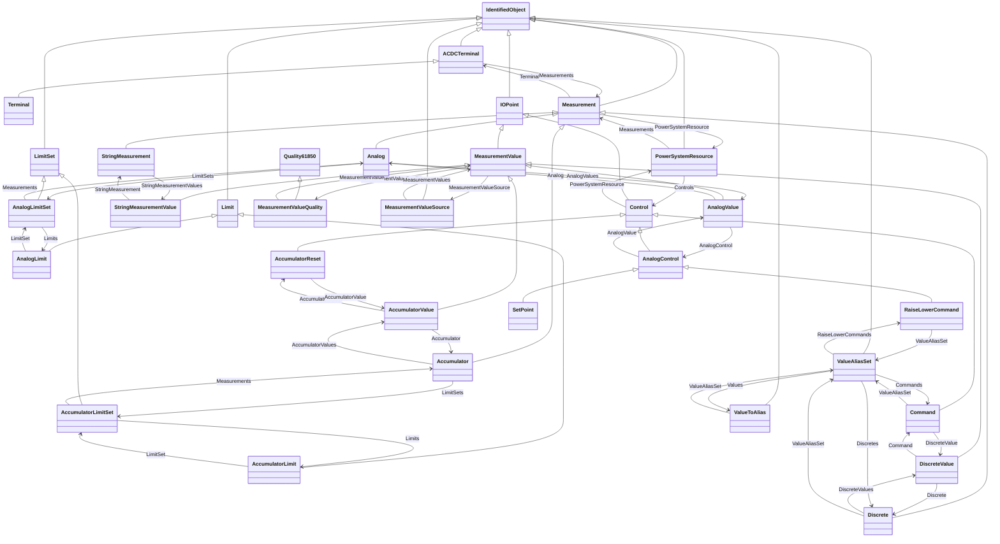

# Package_OperationProfile

## Overview Diagram

<button class="mermaid-enlarge-button">Enlarge Diagram</button>

## Classes

- [ACDCTerminal](../Classes/ACDCTerminal): An electrical connection point (AC or DC) to a piece of conducting equipment.
- [Accumulator](../Classes/Accumulator): Accumulator represents an accumulated (counted) Measurement, e.
- [AccumulatorLimit](../Classes/AccumulatorLimit): Limit values for Accumulator measurements.
- [AccumulatorLimitSet](../Classes/AccumulatorLimitSet): An AccumulatorLimitSet specifies a set of Limits that are associated with an Accumulator measurement.
- [AccumulatorReset](../Classes/AccumulatorReset): This command resets the counter value to zero.
- [AccumulatorValue](../Classes/AccumulatorValue): AccumulatorValue represents an accumulated (counted) MeasurementValue.
- [Analog](../Classes/Analog): Analog represents an analog Measurement.
- [AnalogControl](../Classes/AnalogControl): An analog control used for supervisory control.
- [AnalogLimit](../Classes/AnalogLimit): Limit values for Analog measurements.
- [AnalogLimitSet](../Classes/AnalogLimitSet): An AnalogLimitSet specifies a set of Limits that are associated with an Analog measurement.
- [AnalogValue](../Classes/AnalogValue): AnalogValue represents an analog MeasurementValue.
- [Command](../Classes/Command): A Command is a discrete control used for supervisory control.
- [Control](../Classes/Control): Control is used for supervisory/device control.
- [Discrete](../Classes/Discrete): Discrete represents a discrete Measurement, i.
- [DiscreteValue](../Classes/DiscreteValue): DiscreteValue represents a discrete MeasurementValue.
- [IOPoint](../Classes/IOPoint): The class describe a measurement or control value.
- [IdentifiedObject](../Classes/IdentifiedObject): This is a root class to provide common identification for all classes needing identification and naming attributes.
- [Limit](../Classes/Limit): Specifies one limit value for a Measurement.
- [LimitSet](../Classes/LimitSet): Specifies a set of Limits that are associated with a Measurement.
- [Measurement](../Classes/Measurement): A Measurement represents any measured, calculated or non-measured non-calculated quantity.
- [MeasurementValue](../Classes/MeasurementValue): The current state for a measurement.
- [MeasurementValueQuality](../Classes/MeasurementValueQuality): Measurement quality flags.
- [MeasurementValueSource](../Classes/MeasurementValueSource): MeasurementValueSource describes the alternative sources updating a MeasurementValue.
- [PowerSystemResource](../Classes/PowerSystemResource): A power system resource (PSR) can be an item of equipment such as a switch, an equipment container containing many individual items of equipment such as a substation, or an organisational entity such as sub-control area.
- [Quality61850](../Classes/Quality61850): Quality flags in this class are as defined in IEC 61850, except for estimatorReplaced, which has been included in this class for convenience.
- [RaiseLowerCommand](../Classes/RaiseLowerCommand): An analog control that increases or decreases a set point value with pulses.
- [SetPoint](../Classes/SetPoint): An analog control that issues a set point value.
- [StringMeasurement](../Classes/StringMeasurement): StringMeasurement represents a measurement with values of type string.
- [StringMeasurementValue](../Classes/StringMeasurementValue): StringMeasurementValue represents a measurement value of type string.
- [Terminal](../Classes/Terminal): An AC electrical connection point to a piece of conducting equipment.
- [ValueAliasSet](../Classes/ValueAliasSet): Describes the translation of a set of values into a name and is intendend to facilitate custom translations.
- [ValueToAlias](../Classes/ValueToAlias): Describes the translation of one particular value into a name, e.
