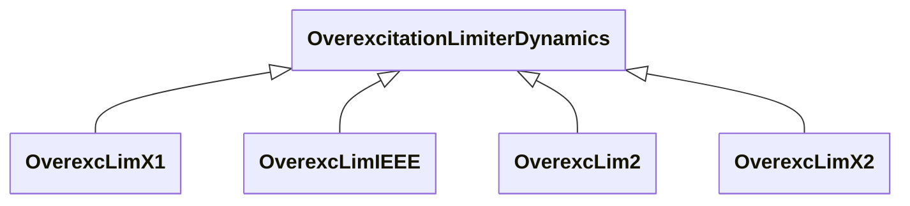

# Package_OverexcitationLimiterDynamics

## Overview Diagram

<button class="mermaid-enlarge-button">Enlarge Diagram</button>

## Classes

- [OverexcLim2](../Classes/OverexcLim2): Different from LimIEEEOEL, LimOEL2 has a fixed pickup threshold and reduces the excitation set-point by means of a non-windup integral regulator.
- [OverexcLimIEEE](../Classes/OverexcLimIEEE): The over excitation limiter model is intended to represent the significant features of OELs necessary for some large-scale system studies.
- [OverexcLimX1](../Classes/OverexcLimX1): Field voltage over excitation limiter.
- [OverexcLimX2](../Classes/OverexcLimX2): Field voltage or current overexcitation limiter designed to protect the generator field of an AC machine with automatic excitation control from overheating due to prolonged overexcitation.
- [OverexcitationLimiterDynamics](../Classes/OverexcitationLimiterDynamics): Overexcitation limiter function block whose behaviour is described by reference to a standard model or by definition of a user-defined model.
