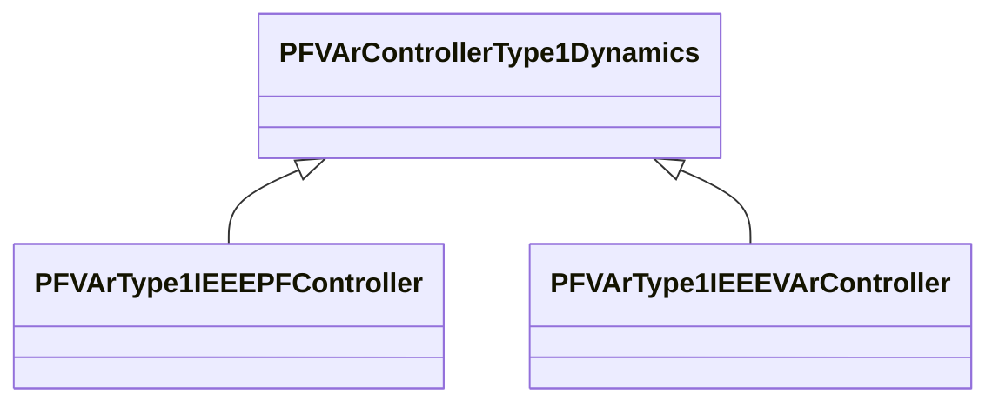

# Package_PFVArControllerType1Dynamics

## Overview Diagram

<button class="mermaid-enlarge-button">Enlarge Diagram</button>

## Classes

- [PFVArControllerType1Dynamics](../Classes/PFVArControllerType1Dynamics): Power factor or VAr controller type 1 function block whose behaviour is described by reference to a standard model or by definition of a user-defined model.
- [PFVArType1IEEEPFController](../Classes/PFVArType1IEEEPFController): IEEE PF controller type 1 which operates by moving the voltage reference directly.
- [PFVArType1IEEEVArController](../Classes/PFVArType1IEEEVArController): IEEE VAR controller type 1 which operates by moving the voltage reference directly.
