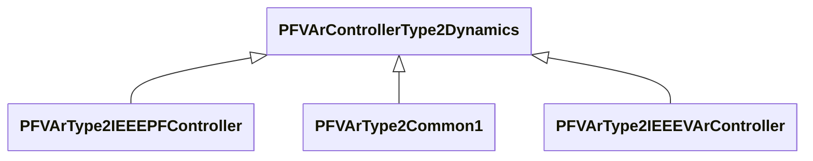

# Package_PFVArControllerType2Dynamics

## Overview Diagram

<button class="mermaid-enlarge-button">Enlarge Diagram</button>

## Classes

- [PFVArControllerType2Dynamics](../Classes/PFVArControllerType2Dynamics): Power factor or VAr controller type 2 function block whose behaviour is described by reference to a standard model or by definition of a user-defined model.
- [PFVArType2Common1](../Classes/PFVArType2Common1): Power factor / reactive power regulator.
- [PFVArType2IEEEPFController](../Classes/PFVArType2IEEEPFController): IEEE PF controller type 2 which is a summing point type controller making up the outside loop of a two-loop system.
- [PFVArType2IEEEVArController](../Classes/PFVArType2IEEEVArController): IEEE VAR controller type 2 which is a summing point type controller.
