# Package_PowerSystemStabilizerDynamics

## Overview Diagram

```mermaid
---
  config:
    class:
      hideEmptyMembersBox: true
---
classDiagram
    PowerSystemStabilizerDynamics <|-- PssSK
    PowerSystemStabilizerDynamics <|-- PssIEEE1A
    PowerSystemStabilizerDynamics <|-- Pss1
    PowerSystemStabilizerDynamics <|-- PssPTIST3
    PowerSystemStabilizerDynamics <|-- PssSH
    PowerSystemStabilizerDynamics <|-- PssIEEE2B
    PowerSystemStabilizerDynamics <|-- PssSB4
    PowerSystemStabilizerDynamics <|-- Pss2B
    PowerSystemStabilizerDynamics <|-- PssWECC
    PowerSystemStabilizerDynamics <|-- PssSTAB2A
    PowerSystemStabilizerDynamics <|-- PssIEEE4B
    PowerSystemStabilizerDynamics <|-- Pss1A
    PowerSystemStabilizerDynamics <|-- PssPTIST1
    PowerSystemStabilizerDynamics <|-- Pss5
    PowerSystemStabilizerDynamics <|-- PssELIN2
    PowerSystemStabilizerDynamics <|-- PssIEEE3B
    PowerSystemStabilizerDynamics <|-- Pss2ST
    PowerSystemStabilizerDynamics <|-- PssRQB
```

<button class="mermaid-enlarge-button">Enlarge Diagram</button>

## Classes

- [PowerSystemStabilizerDynamics](../Classes/PowerSystemStabilizerDynamics): Power system stabilizer function block whose behaviour is described by reference to a standard model or by definition of a user-defined model.
- [Pss1](../Classes/Pss1): Italian PSS with three inputs (speed, frequency, power).
- [Pss1A](../Classes/Pss1A): Single input power system stabilizer.
- [Pss2B](../Classes/Pss2B): Modified IEEE PSS2B.
- [Pss2ST](../Classes/Pss2ST): PTI microprocessor-based stabilizer type 1.
- [Pss5](../Classes/Pss5): Detailed Italian PSS.
- [PssELIN2](../Classes/PssELIN2): Power system stabilizer typically associated with ExcELIN2 (though PssIEEE2B or Pss2B can also be used).
- [PssIEEE1A](../Classes/PssIEEE1A): IEEE 421.
- [PssIEEE2B](../Classes/PssIEEE2B): IEEE 421.
- [PssIEEE3B](../Classes/PssIEEE3B): IEEE 421.
- [PssIEEE4B](../Classes/PssIEEE4B): IEEE 421.
- [PssPTIST1](../Classes/PssPTIST1): PTI microprocessor-based stabilizer type 1.
- [PssPTIST3](../Classes/PssPTIST3): PTI microprocessor-based stabilizer type 3.
- [PssRQB](../Classes/PssRQB): Power system stabilizer type RQB.
- [PssSB4](../Classes/PssSB4): Power sensitive stabilizer model.
- [PssSH](../Classes/PssSH): SiemensTM “H infinity” power system stabilizer with generator electrical power input.
- [PssSK](../Classes/PssSK): Slovakian PSS with three inputs.
- [PssSTAB2A](../Classes/PssSTAB2A): Power system stabilizer part of an ABB excitation system.
- [PssWECC](../Classes/PssWECC): Dual input power system stabilizer, based on IEEE type 2, with modified output limiter defined by WECC (Western Electricity Coordinating Council, USA).
