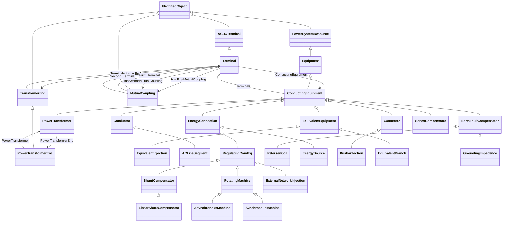

# Package_ShortCircuitProfile

## Overview Diagram

<button class="mermaid-enlarge-button">Enlarge Diagram</button>

## Classes

- [ACDCTerminal](../Classes/ACDCTerminal): An electrical connection point (AC or DC) to a piece of conducting equipment.
- [ACLineSegment](../Classes/ACLineSegment): A wire or combination of wires, with consistent electrical characteristics, building a single electrical system, used to carry alternating current between points in the power system.
- [AsynchronousMachine](../Classes/AsynchronousMachine): A rotating machine whose shaft rotates asynchronously with the electrical field.
- [BusbarSection](../Classes/BusbarSection): A conductor, or group of conductors, with negligible impedance, that serve to connect other conducting equipment within a single substation.
- [ConductingEquipment](../Classes/ConductingEquipment): The parts of the AC power system that are designed to carry current or that are conductively connected through terminals.
- [Conductor](../Classes/Conductor): Combination of conducting material with consistent electrical characteristics, building a single electrical system, used to carry current between points in the power system.
- [Connector](../Classes/Connector): A conductor, or group of conductors, with negligible impedance, that serve to connect other conducting equipment within a single substation and are modelled with a single logical terminal.
- [EarthFaultCompensator](../Classes/EarthFaultCompensator): A conducting equipment used to represent a connection to ground which is typically used to compensate earth faults.
- [EnergyConnection](../Classes/EnergyConnection): A connection of energy generation or consumption on the power system model.
- [EnergySource](../Classes/EnergySource): A generic equivalent for an energy supplier on a transmission or distribution voltage level.
- [Equipment](../Classes/Equipment): The parts of a power system that are physical devices, electronic or mechanical.
- [EquivalentBranch](../Classes/EquivalentBranch): The class represents equivalent branches.
- [EquivalentEquipment](../Classes/EquivalentEquipment): The class represents equivalent objects that are the result of a network reduction.
- [EquivalentInjection](../Classes/EquivalentInjection): This class represents equivalent injections (generation or load).
- [ExternalNetworkInjection](../Classes/ExternalNetworkInjection): This class represents the external network and it is used for IEC 60909 calculations.
- [GroundingImpedance](../Classes/GroundingImpedance): A fixed impedance device used for grounding.
- [IdentifiedObject](../Classes/IdentifiedObject): This is a root class to provide common identification for all classes needing identification and naming attributes.
- [LinearShuntCompensator](../Classes/LinearShuntCompensator): A linear shunt compensator has banks or sections with equal admittance values.
- [MutualCoupling](../Classes/MutualCoupling): This class represents the zero sequence line mutual coupling.
- [NonlinearShuntCompensatorPoint](../Classes/NonlinearShuntCompensatorPoint): A non linear shunt compensator bank or section admittance value.
- [PetersenCoil](../Classes/PetersenCoil): A variable impedance device normally used to offset line charging during single line faults in an ungrounded section of network.
- [PowerSystemResource](../Classes/PowerSystemResource): A power system resource (PSR) can be an item of equipment such as a switch, an equipment container containing many individual items of equipment such as a substation, or an organisational entity such as sub-control area.
- [PowerTransformer](../Classes/PowerTransformer): An electrical device consisting of two or more coupled windings, with or without a magnetic core, for introducing mutual coupling between electric circuits.
- [PowerTransformerEnd](../Classes/PowerTransformerEnd): A PowerTransformerEnd is associated with each Terminal of a PowerTransformer.
- [RegulatingCondEq](../Classes/RegulatingCondEq): A type of conducting equipment that can regulate a quantity (i.
- [RotatingMachine](../Classes/RotatingMachine): A rotating machine which may be used as a generator or motor.
- [SeriesCompensator](../Classes/SeriesCompensator): A Series Compensator is a series capacitor or reactor or an AC transmission line without charging susceptance.
- [ShuntCompensator](../Classes/ShuntCompensator): A shunt capacitor or reactor or switchable bank of shunt capacitors or reactors.
- [SynchronousMachine](../Classes/SynchronousMachine): An electromechanical device that operates with shaft rotating synchronously with the network.
- [Terminal](../Classes/Terminal): An AC electrical connection point to a piece of conducting equipment.
- [TransformerEnd](../Classes/TransformerEnd): A conducting connection point of a power transformer.
