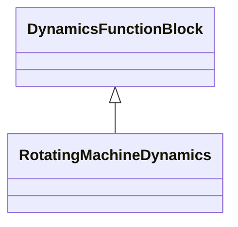

# Package_StandardModels

## Overview Diagram

<button class="mermaid-enlarge-button">Enlarge Diagram</button>

## Classes

- [DynamicsFunctionBlock](../Classes/DynamicsFunctionBlock): Abstract parent class for all Dynamics function blocks.
- [RotatingMachineDynamics](../Classes/RotatingMachineDynamics): Abstract parent class for all synchronous and asynchronous machine standard models.
