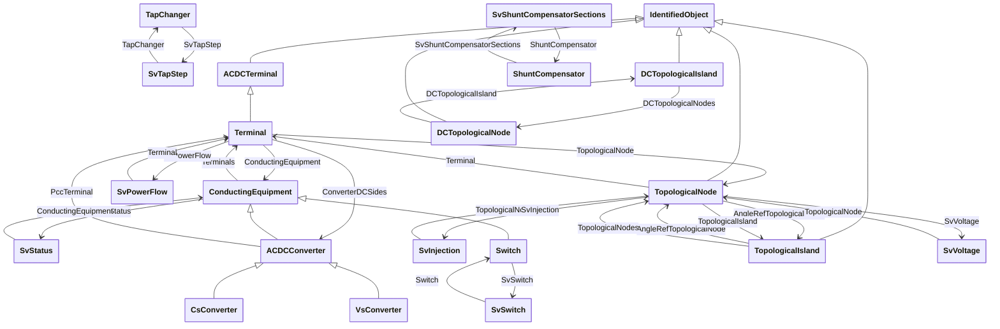

# Package_StateVariablesProfile

## Overview Diagram

<button class="mermaid-enlarge-button">Enlarge Diagram</button>

## Classes

- [ACDCConverter](../Classes/ACDCConverter): A unit with valves for three phases, together with unit control equipment, essential protective and switching devices, DC storage capacitors, phase reactors and auxiliaries, if any, used for conversion.
- [ACDCTerminal](../Classes/ACDCTerminal): An electrical connection point (AC or DC) to a piece of conducting equipment.
- [ConductingEquipment](../Classes/ConductingEquipment): The parts of the AC power system that are designed to carry current or that are conductively connected through terminals.
- [CsConverter](../Classes/CsConverter): DC side of the current source converter (CSC).
- [DCTopologicalIsland](../Classes/DCTopologicalIsland): An electrically connected subset of the network.
- [DCTopologicalNode](../Classes/DCTopologicalNode): DC bus.
- [IdentifiedObject](../Classes/IdentifiedObject): This is a root class to provide common identification for all classes needing identification and naming attributes.
- [ShuntCompensator](../Classes/ShuntCompensator): A shunt capacitor or reactor or switchable bank of shunt capacitors or reactors.
- [SvInjection](../Classes/SvInjection): The SvInjection reports the calculated bus injection minus the sum of the terminal flows.
- [SvPowerFlow](../Classes/SvPowerFlow): State variable for power flow.
- [SvShuntCompensatorSections](../Classes/SvShuntCompensatorSections): State variable for the number of sections in service for a shunt compensator.
- [SvStatus](../Classes/SvStatus): State variable for status.
- [SvSwitch](../Classes/SvSwitch): State variable for switch.
- [SvTapStep](../Classes/SvTapStep): State variable for transformer tap step.
- [SvVoltage](../Classes/SvVoltage): State variable for voltage.
- [Switch](../Classes/Switch): A generic device designed to close, or open, or both, one or more electric circuits.
- [TapChanger](../Classes/TapChanger): Mechanism for changing transformer winding tap positions.
- [Terminal](../Classes/Terminal): An AC electrical connection point to a piece of conducting equipment.
- [TopologicalIsland](../Classes/TopologicalIsland): An electrically connected subset of the network.
- [TopologicalNode](../Classes/TopologicalNode): For a detailed substation model a topological node is a set of connectivity nodes that, in the current network state, are connected together through any type of closed switches, including jumpers.
- [VsConverter](../Classes/VsConverter): DC side of the voltage source converter (VSC).
