# Package_SteadyStateHypothesisProfile

## Overview Diagram

```mermaid
---
  config:
    class:
      hideEmptyMembersBox: true
---
classDiagram
    RegulatingCondEq <|-- RotatingMachine
    RotatingMachine --> GeneratingUnit : GeneratingUnit
    ConductingEquipment <|-- EnergyConnection
    EnergyConsumer <|-- NonConformLoad
    PowerSystemResource <|-- ControlArea
    PhaseTapChanger <|-- PhaseTapChangerLinear
    TapChanger <|-- RatioTapChanger
    Equipment <|-- GeneratingUnit
    GeneratingUnit --> RotatingMachine : RotatingMachine
    PowerSystemResource <|-- TapChanger
    TapChanger --> TapChangerControl : TapChangerControl
    ACDCTerminal <|-- DCBaseTerminal
    IdentifiedObject <|-- ACDCTerminal
    RotatingMachine <|-- AsynchronousMachine
    Equipment <|-- ConductingEquipment
    ConductingEquipment --> Terminal : Terminals
    DCBaseTerminal <|-- DCTerminal
    Switch <|-- Disconnector
    ACDCConverter <|-- CsConverter
    RotatingMachine <|-- SynchronousMachine
    Equipment <|-- PowerElectronicsUnit
    PowerElectronicsUnit --> PowerElectronicsConnection : PowerElectronicsConnection
    Switch <|-- GroundDisconnector
    PhaseTapChangerNonLinear <|-- PhaseTapChangerAsymmetrical
    Breaker <|-- DisconnectingCircuitBreaker
    ACDCTerminal <|-- Terminal
    Terminal --> ConductingEquipment : ConductingEquipment
    Terminal --> ACDCConverter : ConverterDCSides
    Terminal --> RegulatingControl : RegulatingControl
    ProtectedSwitch <|-- LoadBreakSwitch
    ACDCConverter <|-- VsConverter
    Switch <|-- ProtectedSwitch
    GeneratingUnit <|-- SolarGeneratingUnit
    ShuntCompensator <|-- NonlinearShuntCompensator
    PhaseTapChanger <|-- PhaseTapChangerNonLinear
    ConductingEquipment <|-- EquivalentEquipment
    EquivalentEquipment <|-- EquivalentInjection
    ConductingEquipment <|-- ACDCConverter
    ACDCConverter --> ACDCConverterDCTerminal : DCTerminals
    ACDCConverter --> Terminal : PccTerminal
    EnergyConsumer <|-- StationSupply
    IdentifiedObject <|-- PowerSystemResource
    Switch <|-- Fuse
    ShuntCompensator <|-- LinearShuntCompensator
    OperationalLimit <|-- ApparentPowerLimit
    PhaseTapChangerNonLinear <|-- PhaseTapChangerSymmetrical
    PhaseTapChanger <|-- PhaseTapChangerTabular
    DCBaseTerminal <|-- ACDCConverterDCTerminal
    ACDCConverterDCTerminal --> ACDCConverter : DCConductingEquipment
    PowerSystemResource <|-- Equipment
    RegulatingCondEq <|-- ExternalNetworkInjection
    GeneratingUnit <|-- NuclearGeneratingUnit
    OperationalLimit <|-- ActivePowerLimit
    GeneratingUnit <|-- ThermalGeneratingUnit
    TapChanger <|-- PhaseTapChanger
    PowerElectronicsUnit <|-- BatteryUnit
    RegulatingControl <|-- TapChangerControl
    TapChangerControl --> TapChanger : TapChanger
    OperationalLimit <|-- CurrentLimit
    EnergyConnection <|-- EnergySource
    RegulatingCondEq <|-- ShuntCompensator
    EnergyConnection <|-- EnergyConsumer
    IdentifiedObject <|-- OperationalLimit
    Switch <|-- Jumper
    RegulatingCondEq <|-- PowerElectronicsConnection
    PowerElectronicsConnection --> PowerElectronicsUnit : PowerElectronicsUnit
    PowerSystemResource <|-- RegulatingControl
    RegulatingControl --> RegulatingCondEq : RegulatingCondEq
    RegulatingControl --> Terminal : Terminal
    ProtectedSwitch <|-- Breaker
    OperationalLimit <|-- VoltageLimit
    RegulatingCondEq <|-- StaticVarCompensator
    GeneratingUnit <|-- HydroGeneratingUnit
    EnergyConsumer <|-- ConformLoad
    ConductingEquipment <|-- Switch
    EnergyConnection <|-- RegulatingCondEq
    RegulatingCondEq --> RegulatingControl : RegulatingControl
    GeneratingUnit <|-- WindGeneratingUnit
```

<button class="mermaid-enlarge-button">Enlarge Diagram</button>

## Classes

- [ACDCConverter](../Classes/ACDCConverter): A unit with valves for three phases, together with unit control equipment, essential protective and switching devices, DC storage capacitors, phase reactors and auxiliaries, if any, used for conversion.
- [ACDCConverterDCTerminal](../Classes/ACDCConverterDCTerminal): A DC electrical connection point at the AC/DC converter.
- [ACDCTerminal](../Classes/ACDCTerminal): An electrical connection point (AC or DC) to a piece of conducting equipment.
- [ActivePowerLimit](../Classes/ActivePowerLimit): Limit on active power flow.
- [ApparentPowerLimit](../Classes/ApparentPowerLimit): Apparent power limit.
- [AsynchronousMachine](../Classes/AsynchronousMachine): A rotating machine whose shaft rotates asynchronously with the electrical field.
- [BatteryUnit](../Classes/BatteryUnit): An electrochemical energy storage device.
- [Breaker](../Classes/Breaker): A mechanical switching device capable of making, carrying, and breaking currents under normal circuit conditions and also making, carrying for a specified time, and breaking currents under specified abnormal circuit conditions e.
- [ConductingEquipment](../Classes/ConductingEquipment): The parts of the AC power system that are designed to carry current or that are conductively connected through terminals.
- [ConformLoad](../Classes/ConformLoad): ConformLoad represent loads that follow a daily load change pattern where the pattern can be used to scale the load with a system load.
- [ControlArea](../Classes/ControlArea): A control area is a grouping of generating units and/or loads and a cutset of tie lines (as terminals) which may be used for a variety of purposes including automatic generation control, power flow solution area interchange control specification, and input to load forecasting.
- [CsConverter](../Classes/CsConverter): DC side of the current source converter (CSC).
- [CurrentLimit](../Classes/CurrentLimit): Operational limit on current.
- [DCBaseTerminal](../Classes/DCBaseTerminal): An electrical connection point at a piece of DC conducting equipment.
- [DCTerminal](../Classes/DCTerminal): An electrical connection point to generic DC conducting equipment.
- [DisconnectingCircuitBreaker](../Classes/DisconnectingCircuitBreaker): A circuit breaking device including disconnecting function, eliminating the need for separate disconnectors.
- [Disconnector](../Classes/Disconnector): A manually operated or motor operated mechanical switching device used for changing the connections in a circuit, or for isolating a circuit or equipment from a source of power.
- [EnergyConnection](../Classes/EnergyConnection): A connection of energy generation or consumption on the power system model.
- [EnergyConsumer](../Classes/EnergyConsumer): Generic user of energy - a point of consumption on the power system model.
- [EnergySource](../Classes/EnergySource): A generic equivalent for an energy supplier on a transmission or distribution voltage level.
- [Equipment](../Classes/Equipment): The parts of a power system that are physical devices, electronic or mechanical.
- [EquivalentEquipment](../Classes/EquivalentEquipment): The class represents equivalent objects that are the result of a network reduction.
- [EquivalentInjection](../Classes/EquivalentInjection): This class represents equivalent injections (generation or load).
- [ExternalNetworkInjection](../Classes/ExternalNetworkInjection): This class represents the external network and it is used for IEC 60909 calculations.
- [Fuse](../Classes/Fuse): An overcurrent protective device with a circuit opening fusible part that is heated and severed by the passage of overcurrent through it.
- [GeneratingUnit](../Classes/GeneratingUnit): A single or set of synchronous machines for converting mechanical power into alternating-current power.
- [GroundDisconnector](../Classes/GroundDisconnector): A manually operated or motor operated mechanical switching device used for isolating a circuit or equipment from ground.
- [HydroGeneratingUnit](../Classes/HydroGeneratingUnit): A generating unit whose prime mover is a hydraulic turbine (e.
- [IdentifiedObject](../Classes/IdentifiedObject): This is a root class to provide common identification for all classes needing identification and naming attributes.
- [Jumper](../Classes/Jumper): A short section of conductor with negligible impedance which can be manually removed and replaced if the circuit is de-energized.
- [LinearShuntCompensator](../Classes/LinearShuntCompensator): A linear shunt compensator has banks or sections with equal admittance values.
- [LoadBreakSwitch](../Classes/LoadBreakSwitch): A mechanical switching device capable of making, carrying, and breaking currents under normal operating conditions.
- [NonConformLoad](../Classes/NonConformLoad): NonConformLoad represents loads that do not follow a daily load change pattern and whose changes are not correlated with the daily load change pattern.
- [NonlinearShuntCompensator](../Classes/NonlinearShuntCompensator): A non linear shunt compensator has bank or section admittance values that differ.
- [NuclearGeneratingUnit](../Classes/NuclearGeneratingUnit): A nuclear generating unit.
- [OperationalLimit](../Classes/OperationalLimit): A value and normal value associated with a specific kind of limit.
- [PhaseTapChanger](../Classes/PhaseTapChanger): A transformer phase shifting tap model that controls the phase angle difference across the power transformer and potentially the active power flow through the power transformer.
- [PhaseTapChangerAsymmetrical](../Classes/PhaseTapChangerAsymmetrical): Describes the tap model for an asymmetrical phase shifting transformer in which the difference voltage vector adds to the in-phase winding.
- [PhaseTapChangerLinear](../Classes/PhaseTapChangerLinear): Describes a tap changer with a linear relation between the tap step and the phase angle difference across the transformer.
- [PhaseTapChangerNonLinear](../Classes/PhaseTapChangerNonLinear): The non-linear phase tap changer describes the non-linear behaviour of a phase tap changer.
- [PhaseTapChangerSymmetrical](../Classes/PhaseTapChangerSymmetrical): Describes a symmetrical phase shifting transformer tap model in which the voltage magnitude of both sides is the same.
- [PhaseTapChangerTabular](../Classes/PhaseTapChangerTabular): Describes a tap changer with a table defining the relation between the tap step and the phase angle difference across the transformer.
- [PowerElectronicsConnection](../Classes/PowerElectronicsConnection): A connection to the AC network for energy production or consumption that uses power electronics rather than rotating machines.
- [PowerElectronicsUnit](../Classes/PowerElectronicsUnit): A generating unit or battery or aggregation that connects to the AC network using power electronics rather than rotating machines.
- [PowerSystemResource](../Classes/PowerSystemResource): A power system resource (PSR) can be an item of equipment such as a switch, an equipment container containing many individual items of equipment such as a substation, or an organisational entity such as sub-control area.
- [ProtectedSwitch](../Classes/ProtectedSwitch): A ProtectedSwitch is a switching device that can be operated by ProtectionEquipment.
- [RatioTapChanger](../Classes/RatioTapChanger): A tap changer that changes the voltage ratio impacting the voltage magnitude but not the phase angle across the transformer.
- [RegulatingCondEq](../Classes/RegulatingCondEq): A type of conducting equipment that can regulate a quantity (i.
- [RegulatingControl](../Classes/RegulatingControl): Specifies a set of equipment that works together to control a power system quantity such as voltage or flow.
- [RotatingMachine](../Classes/RotatingMachine): A rotating machine which may be used as a generator or motor.
- [ShuntCompensator](../Classes/ShuntCompensator): A shunt capacitor or reactor or switchable bank of shunt capacitors or reactors.
- [SolarGeneratingUnit](../Classes/SolarGeneratingUnit): A solar thermal generating unit, connected to the grid by means of a rotating machine.
- [StaticVarCompensator](../Classes/StaticVarCompensator): A facility for providing variable and controllable shunt reactive power.
- [StationSupply](../Classes/StationSupply): Station supply with load derived from the station output.
- [Switch](../Classes/Switch): A generic device designed to close, or open, or both, one or more electric circuits.
- [SynchronousMachine](../Classes/SynchronousMachine): An electromechanical device that operates with shaft rotating synchronously with the network.
- [TapChanger](../Classes/TapChanger): Mechanism for changing transformer winding tap positions.
- [TapChangerControl](../Classes/TapChangerControl): Describes behaviour specific to tap changers, e.
- [Terminal](../Classes/Terminal): An AC electrical connection point to a piece of conducting equipment.
- [ThermalGeneratingUnit](../Classes/ThermalGeneratingUnit): A generating unit whose prime mover could be a steam turbine, combustion turbine, or diesel engine.
- [VoltageLimit](../Classes/VoltageLimit): Operational limit applied to voltage.
- [VsConverter](../Classes/VsConverter): DC side of the voltage source converter (VSC).
- [WindGeneratingUnit](../Classes/WindGeneratingUnit): A wind driven generating unit, connected to the grid by means of a rotating machine.
