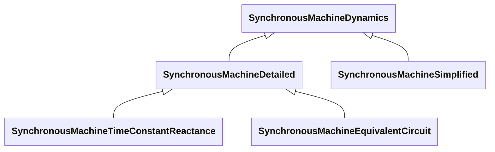

# Package_SynchronousMachineDynamics

## Overview Diagram

<button class="mermaid-enlarge-button">Enlarge Diagram</button>

## Classes

- [SynchronousMachineDetailed](../Classes/SynchronousMachineDetailed): All synchronous machine detailed types use a subset of the same data parameters and input/output variables.
- [SynchronousMachineDynamics](../Classes/SynchronousMachineDynamics): Synchronous machine whose behaviour is described by reference to a standard model expressed in one of the following forms: - simplified (or classical), where a group of generators or motors is not modelled in detail; - detailed, in equivalent circuit form; - detailed, in time constant reactance form; or - by definition of a user-defined model.
- [SynchronousMachineEquivalentCircuit](../Classes/SynchronousMachineEquivalentCircuit): The electrical equations for all variations of the synchronous models are based on the SynchronousEquivalentCircuit diagram for the direct- and quadrature- axes.
- [SynchronousMachineSimplified](../Classes/SynchronousMachineSimplified): The simplified model represents a synchronous generator as a constant internal voltage behind an impedance (Rs + jXp) as shown in the Simplified diagram.
- [SynchronousMachineTimeConstantReactance](../Classes/SynchronousMachineTimeConstantReactance): Synchronous machine detailed modelling types are defined by the combination of the attributes SynchronousMachineTimeConstantReactance.
