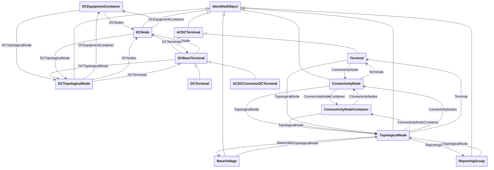

# Package_TopologyProfile

## Overview Diagram

<button class="mermaid-enlarge-button">Enlarge Diagram</button>

## Classes

- [ACDCConverterDCTerminal](../Classes/ACDCConverterDCTerminal): A DC electrical connection point at the AC/DC converter.
- [ACDCTerminal](../Classes/ACDCTerminal): An electrical connection point (AC or DC) to a piece of conducting equipment.
- [BaseVoltage](../Classes/BaseVoltage): Defines a system base voltage which is referenced.
- [ConnectivityNode](../Classes/ConnectivityNode): Connectivity nodes are points where terminals of AC conducting equipment are connected together with zero impedance.
- [ConnectivityNodeContainer](../Classes/ConnectivityNodeContainer): A base class for all objects that may contain connectivity nodes or topological nodes.
- [DCBaseTerminal](../Classes/DCBaseTerminal): An electrical connection point at a piece of DC conducting equipment.
- [DCEquipmentContainer](../Classes/DCEquipmentContainer): A modelling construct to provide a root class for containment of DC as well as AC equipment.
- [DCNode](../Classes/DCNode): DC nodes are points where terminals of DC conducting equipment are connected together with zero impedance.
- [DCTerminal](../Classes/DCTerminal): An electrical connection point to generic DC conducting equipment.
- [DCTopologicalNode](../Classes/DCTopologicalNode): DC bus.
- [IdentifiedObject](../Classes/IdentifiedObject): This is a root class to provide common identification for all classes needing identification and naming attributes.
- [ReportingGroup](../Classes/ReportingGroup): A reporting group is used for various ad-hoc groupings used for reporting.
- [Terminal](../Classes/Terminal): An AC electrical connection point to a piece of conducting equipment.
- [TopologicalNode](../Classes/TopologicalNode): For a detailed substation model a topological node is a set of connectivity nodes that, in the current network state, are connected together through any type of closed switches, including jumpers.
