# Package_TurbineGovernorDynamics

## Overview Diagram

```mermaid
classDiagram
    TurbineGovernorDynamics <|-- GovHydro1
    TurbineGovernorDynamics <|-- GovGAST2
    TurbineGovernorDynamics <|-- GovSteamFV2
    TurbineGovernorDynamics <|-- GovGAST1
    TurbineGovernorDynamics <|-- GovHydroPID
    TurbineGovernorDynamics <|-- GovGAST4
    CrossCompoundTurbineGovernorDynamics <|-- GovSteamCC
    TurbineGovernorDynamics <|-- GovCT2
    TurbineGovernorDynamics <|-- GovHydroPelton
    TurbineGovernorDynamics <|-- GovSteamSGO
    TurbineGovernorDynamics <|-- GovSteamFV3
    TurbineGovernorDynamics <|-- GovHydroFrancis
    TurbineGovernorDynamics <|-- GovHydro2
    TurbineGovernorDynamics <|-- GovHydroWPID
    TurbineGovernorDynamics <|-- GovGASTWD
    TurbineGovernorDynamics <|-- GovHydroDD
    TurbineGovernorDynamics <|-- GovGAST3
    TurbineGovernorDynamics <|-- GovHydro4
    TurbineGovernorDynamics <|-- GovSteamIEEE1
    TurbineGovernorDynamics <|-- GovSteam0
    TurbineGovernorDynamics <|-- GovSteamFV4
    TurbineGovernorDynamics <|-- GovHydroIEEE2
    TurbineGovernorDynamics <|-- GovHydroR
    TurbineGovernorDynamics <|-- GovHydroPID2
    TurbineGovernorDynamics <|-- GovSteam2
    TurbineGovernorDynamics <|-- GovSteamEU
    TurbineGovernorDynamics <|-- GovSteam1
    TurbineGovernorDynamics <|-- GovHydroWEH
    TurbineGovernorDynamics <|-- GovHydroIEEE0
    TurbineGovernorDynamics <|-- GovGAST
    TurbineGovernorDynamics <|-- GovCT1
    TurbineGovernorDynamics <|-- GovSteamBB
    TurbineGovernorDynamics <|-- GovHydro3
```

<button class="mermaid-enlarge-button">Enlarge Diagram</button>

## Classes

- [CrossCompoundTurbineGovernorDynamics](../Classes/CrossCompoundTurbineGovernorDynamics): Turbine-governor cross-compound function block whose behaviour is described by reference to a standard model or by definition of a user-defined model.
- [GovCT1](../Classes/GovCT1): General model for any prime mover with a PID governor, used primarily for combustion turbine and combined cycle units.
- [GovCT2](../Classes/GovCT2): General governor with frequency-dependent fuel flow limit.
- [GovGAST](../Classes/GovGAST): Single shaft gas turbine.
- [GovGAST1](../Classes/GovGAST1): Modified single shaft gas turbine.
- [GovGAST2](../Classes/GovGAST2): Gas turbine.
- [GovGAST3](../Classes/GovGAST3): Generic turbogas with acceleration and temperature controller.
- [GovGAST4](../Classes/GovGAST4): Generic turbogas.
- [GovGASTWD](../Classes/GovGASTWD): Woodward™ gas turbine governor.
- [GovHydro1](../Classes/GovHydro1): Basic hydro turbine governor.
- [GovHydro2](../Classes/GovHydro2): IEEE hydro turbine governor with straightforward penstock configuration and hydraulic-dashpot governor.
- [GovHydro3](../Classes/GovHydro3): Modified IEEE hydro governor-turbine.
- [GovHydro4](../Classes/GovHydro4): Hydro turbine and governor.
- [GovHydroDD](../Classes/GovHydroDD): Double derivative hydro governor and turbine.
- [GovHydroFrancis](../Classes/GovHydroFrancis): Detailed hydro unit - Francis model.
- [GovHydroIEEE0](../Classes/GovHydroIEEE0): IEEE simplified hydro governor-turbine model.
- [GovHydroIEEE2](../Classes/GovHydroIEEE2): IEEE hydro turbine governor model represents plants with straightforward penstock configurations and hydraulic-dashpot governors.
- [GovHydroPID](../Classes/GovHydroPID): PID governor and turbine.
- [GovHydroPID2](../Classes/GovHydroPID2): Hydro turbine and governor.
- [GovHydroPelton](../Classes/GovHydroPelton): Detailed hydro unit - Pelton model.
- [GovHydroR](../Classes/GovHydroR): Fourth order lead-lag governor and hydro turbine.
- [GovHydroWEH](../Classes/GovHydroWEH): WoodwardTM electric hydro governor.
- [GovHydroWPID](../Classes/GovHydroWPID): WoodwardTM PID hydro governor.
- [GovSteam0](../Classes/GovSteam0): A simplified steam turbine governor.
- [GovSteam1](../Classes/GovSteam1): Steam turbine governor, based on the GovSteamIEEE1 (with optional deadband and nonlinear valve gain added).
- [GovSteam2](../Classes/GovSteam2): Simplified governor.
- [GovSteamBB](../Classes/GovSteamBB): European governor model.
- [GovSteamCC](../Classes/GovSteamCC): Cross compound turbine governor.
- [GovSteamEU](../Classes/GovSteamEU): Simplified boiler and steam turbine with PID governor.
- [GovSteamFV2](../Classes/GovSteamFV2): Steam turbine governor with reheat time constants and modelling of the effects of fast valve closing to reduce mechanical power.
- [GovSteamFV3](../Classes/GovSteamFV3): Simplified GovSteamIEEE1 steam turbine governor with Prmax limit and fast valving.
- [GovSteamFV4](../Classes/GovSteamFV4): Detailed electro-hydraulic governor for steam unit.
- [GovSteamIEEE1](../Classes/GovSteamIEEE1): IEEE steam turbine governor model.
- [GovSteamSGO](../Classes/GovSteamSGO): Simplified steam turbine governor.
- [TurbineGovernorDynamics](../Classes/TurbineGovernorDynamics): Turbine-governor function block whose behaviour is described by reference to a standard model or by definition of a user-defined model.
