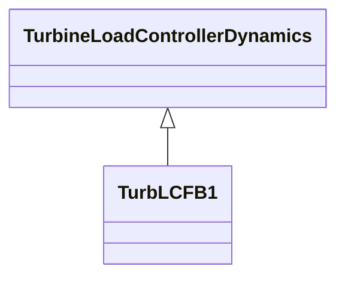

# Package_TurbineLoadControllerDynamics

## Overview Diagram

<button class="mermaid-enlarge-button">Enlarge Diagram</button>

## Classes

- [TurbLCFB1](../Classes/TurbLCFB1): Turbine load controller model developed by WECC.
- [TurbineLoadControllerDynamics](../Classes/TurbineLoadControllerDynamics): Turbine load controller function block whose behaviour is described by reference to a standard model or by definition of a user-defined model.
