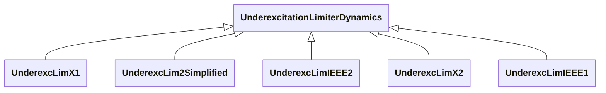

# Package_UnderexcitationLimiterDynamics

## Overview Diagram

<button class="mermaid-enlarge-button">Enlarge Diagram</button>

## Classes

- [UnderexcLim2Simplified](../Classes/UnderexcLim2Simplified): Simplified type UEL2 underexcitation limiter.
- [UnderexcLimIEEE1](../Classes/UnderexcLimIEEE1): Type UEL1 model which has a circular limit boundary when plotted in terms of machine reactive power vs.
- [UnderexcLimIEEE2](../Classes/UnderexcLimIEEE2): Type UEL2 underexcitation limiter which has either a straight-line or multi-segment characteristic when plotted in terms of machine reactive power output vs.
- [UnderexcLimX1](../Classes/UnderexcLimX1): Allis-Chalmers minimum excitation limiter.
- [UnderexcLimX2](../Classes/UnderexcLimX2): Westinghouse minimum excitation limiter.
- [UnderexcitationLimiterDynamics](../Classes/UnderexcitationLimiterDynamics): Underexcitation limiter function block whose behaviour is described by reference to a standard model or by definition of a user-defined model.
