# Package_UserDefinedModels

## Overview Diagram

```mermaid
---
  config:
    class:
      hideEmptyMembersBox: true
---
classDiagram
    PFVArControllerType2UserDefined --> ProprietaryParameterDynamics : ProprietaryParameterDynamics
    AsynchronousMachineUserDefined --> ProprietaryParameterDynamics : ProprietaryParameterDynamics
    ProprietaryParameterDynamics --> AsynchronousMachineUserDefined : AsynchronousMachineUserDefined
    ProprietaryParameterDynamics --> CSCUserDefined : CSCUserDefined
    ProprietaryParameterDynamics --> DiscontinuousExcitationControlUserDefined : DiscontinuousExcitationControlUserDefined
    ProprietaryParameterDynamics --> ExcitationSystemUserDefined : ExcitationSystemUserDefined
    ProprietaryParameterDynamics --> LoadUserDefined : LoadUserDefined
    ProprietaryParameterDynamics --> MechanicalLoadUserDefined : MechanicalLoadUserDefined
    ProprietaryParameterDynamics --> OverexcitationLimiterUserDefined : OverexcitationLimiterUserDefined
    ProprietaryParameterDynamics --> PFVArControllerType1UserDefined : PFVArControllerType1UserDefined
    ProprietaryParameterDynamics --> PFVArControllerType2UserDefined : PFVArControllerType2UserDefined
    ProprietaryParameterDynamics --> PowerSystemStabilizerUserDefined : PowerSystemStabilizerUserDefined
    ProprietaryParameterDynamics --> SVCUserDefined : SVCUserDefined
    ProprietaryParameterDynamics --> SynchronousMachineUserDefined : SynchronousMachineUserDefined
    ProprietaryParameterDynamics --> TurbineGovernorUserDefined : TurbineGovernorUserDefined
    ProprietaryParameterDynamics --> TurbineLoadControllerUserDefined : TurbineLoadControllerUserDefined
    ProprietaryParameterDynamics --> UnderexcitationLimiterUserDefined : UnderexcitationLimiterUserDefined
    ProprietaryParameterDynamics --> VSCUserDefined : VSCUserDefined
    ProprietaryParameterDynamics --> VoltageAdjusterUserDefined : VoltageAdjusterUserDefined
    ProprietaryParameterDynamics --> VoltageCompensatorUserDefined : VoltageCompensatorUserDefined
    ProprietaryParameterDynamics --> WindPlantUserDefined : WindPlantUserDefined
    ProprietaryParameterDynamics --> WindType1or2UserDefined : WindType1or2UserDefined
    ProprietaryParameterDynamics --> WindType3or4UserDefined : WindType3or4UserDefined
    MechanicalLoadUserDefined --> ProprietaryParameterDynamics : ProprietaryParameterDynamics
    WindPlantUserDefined --> ProprietaryParameterDynamics : ProprietaryParameterDynamics
    CSCUserDefined --> ProprietaryParameterDynamics : ProprietaryParameterDynamics
    UnderexcitationLimiterUserDefined --> ProprietaryParameterDynamics : ProprietaryParameterDynamics
    VoltageAdjusterUserDefined --> ProprietaryParameterDynamics : ProprietaryParameterDynamics
    OverexcitationLimiterUserDefined --> ProprietaryParameterDynamics : ProprietaryParameterDynamics
    TurbineGovernorUserDefined --> ProprietaryParameterDynamics : ProprietaryParameterDynamics
    SVCUserDefined --> ProprietaryParameterDynamics : ProprietaryParameterDynamics
    VoltageCompensatorUserDefined --> ProprietaryParameterDynamics : ProprietaryParameterDynamics
    PowerSystemStabilizerUserDefined --> ProprietaryParameterDynamics : ProprietaryParameterDynamics
    WindType3or4UserDefined --> ProprietaryParameterDynamics : ProprietaryParameterDynamics
    VSCUserDefined --> ProprietaryParameterDynamics : ProprietaryParameterDynamics
    DiscontinuousExcitationControlUserDefined --> ProprietaryParameterDynamics : ProprietaryParameterDynamics
    WindType1or2UserDefined --> ProprietaryParameterDynamics : ProprietaryParameterDynamics
    LoadUserDefined --> ProprietaryParameterDynamics : ProprietaryParameterDynamics
    TurbineLoadControllerUserDefined --> ProprietaryParameterDynamics : ProprietaryParameterDynamics
    SynchronousMachineUserDefined --> ProprietaryParameterDynamics : ProprietaryParameterDynamics
    PFVArControllerType1UserDefined --> ProprietaryParameterDynamics : ProprietaryParameterDynamics
    ExcitationSystemUserDefined --> ProprietaryParameterDynamics : ProprietaryParameterDynamics
```

<button class="mermaid-enlarge-button">Enlarge Diagram</button>

## Classes

- [AsynchronousMachineUserDefined](../Classes/AsynchronousMachineUserDefined): Asynchronous machine whose dynamic behaviour is described by a user-defined model.
- [CSCUserDefined](../Classes/CSCUserDefined): Current source converter (CSC) function block whose dynamic behaviour is described by a user-defined model.
- [DiscontinuousExcitationControlUserDefined](../Classes/DiscontinuousExcitationControlUserDefined): Discontinuous excitation control function block whose dynamic behaviour is described by a user-defined model.
- [ExcitationSystemUserDefined](../Classes/ExcitationSystemUserDefined): Excitation system function block whose dynamic behaviour is described by a user-defined model.
- [LoadUserDefined](../Classes/LoadUserDefined): Load whose dynamic behaviour is described by a user-defined model.
- [MechanicalLoadUserDefined](../Classes/MechanicalLoadUserDefined): Mechanical load function block whose dynamic behaviour is described by a user-defined model.
- [OverexcitationLimiterUserDefined](../Classes/OverexcitationLimiterUserDefined): Overexcitation limiter system function block whose dynamic behaviour is described by a user-defined model.
- [PFVArControllerType1UserDefined](../Classes/PFVArControllerType1UserDefined): Power factor or VAr controller type 1 function block whose dynamic behaviour is described by a user-defined model.
- [PFVArControllerType2UserDefined](../Classes/PFVArControllerType2UserDefined): Power factor or VAr controller type 2 function block whose dynamic behaviour is described by a user-defined model.
- [PowerSystemStabilizerUserDefined](../Classes/PowerSystemStabilizerUserDefined): Power system stabilizer function block whose dynamic behaviour is described by a user-defined model.
- [ProprietaryParameterDynamics](../Classes/ProprietaryParameterDynamics): Supports definition of one or more parameters of several different datatypes for use by proprietary user-defined models.
- [SVCUserDefined](../Classes/SVCUserDefined): Static var compensator (SVC) function block whose dynamic behaviour is described by a user-defined model.
- [SynchronousMachineUserDefined](../Classes/SynchronousMachineUserDefined): Synchronous machine whose dynamic behaviour is described by a user-defined model.
- [TurbineGovernorUserDefined](../Classes/TurbineGovernorUserDefined): Turbine-governor function block whose dynamic behaviour is described by a user-defined model.
- [TurbineLoadControllerUserDefined](../Classes/TurbineLoadControllerUserDefined): Turbine load controller function block whose dynamic behaviour is described by a user-defined model.
- [UnderexcitationLimiterUserDefined](../Classes/UnderexcitationLimiterUserDefined): Underexcitation limiter function block whose dynamic behaviour is described by a user-defined model.
- [VSCUserDefined](../Classes/VSCUserDefined): Voltage source converter (VSC) function block whose dynamic behaviour is described by a user-defined model.
- [VoltageAdjusterUserDefined](../Classes/VoltageAdjusterUserDefined): Voltage adjuster function block whose dynamic behaviour is described by a user-defined model.
- [VoltageCompensatorUserDefined](../Classes/VoltageCompensatorUserDefined): Voltage compensator function block whose dynamic behaviour is described by a user-defined model.
- [WindPlantUserDefined](../Classes/WindPlantUserDefined): Wind plant function block whose dynamic behaviour is described by a user-defined model.
- [WindType1or2UserDefined](../Classes/WindType1or2UserDefined): Wind type 1 or type 2 function block whose dynamic behaviour is described by a user-defined model.
- [WindType3or4UserDefined](../Classes/WindType3or4UserDefined): Wind type 3 or type 4 function block whose dynamic behaviour is described by a user-defined model.
