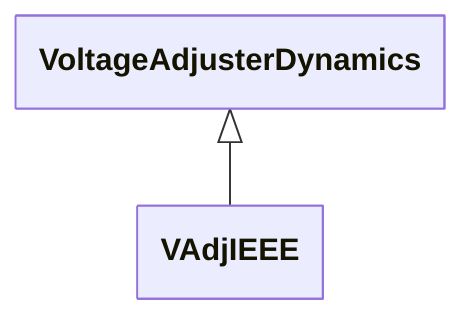

# Package_VoltageAdjusterDynamics

## Overview Diagram

<button class="mermaid-enlarge-button">Enlarge Diagram</button>

## Classes

- [VAdjIEEE](../Classes/VAdjIEEE): IEEE voltage adjuster which is used to represent the voltage adjuster in either a power factor or VAr control system.
- [VoltageAdjusterDynamics](../Classes/VoltageAdjusterDynamics): Voltage adjuster function block whose behaviour is described by reference to a standard model or by definition of a user-defined model.
