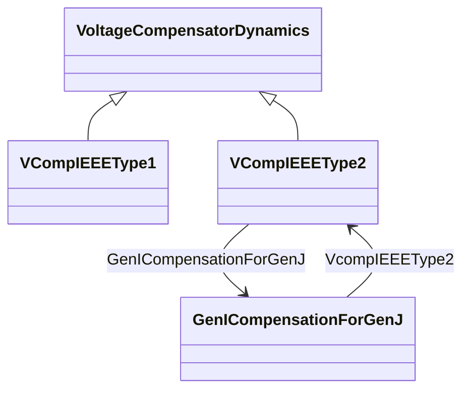

# Package_VoltageCompensatorDynamics

## Overview Diagram

<button class="mermaid-enlarge-button">Enlarge Diagram</button>

## Classes

- [GenICompensationForGenJ](../Classes/GenICompensationForGenJ): Resistive and reactive components of compensation for generator associated with IEEE type 2 voltage compensator for current flow out of another generator in the interconnection.
- [VCompIEEEType1](../Classes/VCompIEEEType1): Terminal voltage transducer and load compensator as defined in IEEE 421.
- [VCompIEEEType2](../Classes/VCompIEEEType2): Terminal voltage transducer and load compensator as defined in IEEE 421.
- [VoltageCompensatorDynamics](../Classes/VoltageCompensatorDynamics): Voltage compensator function block whose behaviour is described by reference to a standard model or by definition of a user-defined model.
