# Package_WindDynamics

## Overview Diagram

```mermaid
classDiagram
    WindTurbineType1or2IEC <|-- WindGenTurbineType1bIEC
    WindGenTurbineType1bIEC --> WindPitchContPowerIEC : WindPitchContPowerIEC
    WindProtectionIEC --> WindDynamicsLookupTable : WindDynamicsLookupTable
    WindProtectionIEC --> WindTurbineType1or2IEC : WindTurbineType1or2IEC
    WindProtectionIEC --> WindTurbineType3or4IEC : WindTurbineType3or4IEC
    WindAeroTwoDimIEC --> WindTurbineType3IEC : WindTurbineType3IEC
    WindMechIEC --> WindTurbineType1or2IEC : WindTurbineType1or2IEC
    WindMechIEC --> WindTurbineType3IEC : WindTurbineType3IEC
    WindMechIEC --> WindTurbineType4bIEC : WindTurbineType4bIEC
    WindContPType4aIEC --> WindTurbineType4aIEC : WindTurbineType4aIEC
    WindContPitchAngleIEC --> WindTurbineType3IEC : WindTurbineType3IEC
    WindPlantDynamics --> WindTurbineType3or4Dynamics : WindTurbineType3or4Dynamics
    WindPlantFreqPcontrolIEC --> WindDynamicsLookupTable : WindDynamicsLookupTable
    WindPlantFreqPcontrolIEC --> WindPlantIEC : WindPlantIEC
    WindPlantReactiveControlIEC --> WindDynamicsLookupTable : WindDynamicsLookupTable
    WindPlantReactiveControlIEC --> WindPlantIEC : WindPlantIEC
    WindGenType4IEC --> WindTurbineType4aIEC : WindTurbineType4aIEC
    WindGenType4IEC --> WindTurbineType4bIEC : WindTurbineType4bIEC
    WindPitchContPowerIEC --> WindDynamicsLookupTable : WindDynamicsLookupTable
    WindPitchContPowerIEC --> WindGenTurbineType1bIEC : WindGenTurbineType1bIEC
    WindPitchContPowerIEC --> WindGenTurbineType2IEC : WindGenTurbineType2IEC
    WindContCurrLimIEC --> WindDynamicsLookupTable : WindDynamicsLookupTable
    WindContCurrLimIEC --> WindTurbineType3or4IEC : WindTurbineType3or4IEC
    WindGenType3IEC --> WindTurbineType3IEC : WindTurbineType3IEC
    WindTurbineType1or2IEC <|-- WindGenTurbineType2IEC
    WindGenTurbineType2IEC --> WindContRotorRIEC : WindContRotorRIEC
    WindGenTurbineType2IEC --> WindPitchContPowerIEC : WindPitchContPowerIEC
    WindContRotorRIEC --> WindDynamicsLookupTable : WindDynamicsLookupTable
    WindContRotorRIEC --> WindGenTurbineType2IEC : WindGenTurbineType2IEC
    WindGenType3IEC <|-- WindGenType3aIEC
    WindGenType3aIEC --> WindTurbineType4IEC : WindTurbineType4IEC
    WindTurbineType3or4Dynamics <|-- WindTurbineType3or4IEC
    WindTurbineType3or4IEC --> WindContQIEC : WIndContQIEC
    WindTurbineType3or4IEC --> WindContCurrLimIEC : WindContCurrLimIEC
    WindTurbineType3or4IEC --> WindContQLimIEC : WindContQLimIEC
    WindTurbineType3or4IEC --> WindContQPQULimIEC : WindContQPQULimIEC
    WindTurbineType3or4IEC --> WindProtectionIEC : WindProtectionIEC
    WindTurbineType3or4IEC --> WindRefFrameRotIEC : WindRefFrameRotIEC
    WindContPType4bIEC --> WindTurbineType4bIEC : WindTurbineType4bIEC
    WindAeroOneDimIEC --> WindTurbineType3IEC : WindTurbineType3IEC
    WindContQPQULimIEC --> WindDynamicsLookupTable : WindDynamicsLookupTable
    WindContQPQULimIEC --> WindTurbineType3or4IEC : WindTurbineType3or4IEC
    WindAeroConstIEC --> WindGenTurbineType1aIEC : WindGenTurbineType1aIEC
    WindTurbineType4IEC <|-- WindTurbineType4bIEC
    WindTurbineType4bIEC --> WindContPType4bIEC : WindContPType4bIEC
    WindTurbineType4bIEC --> WindGenType4IEC : WindGenType4IEC
    WindTurbineType4bIEC --> WindMechIEC : WindMechIEC
    WindTurbineType1or2IEC <|-- WindGenTurbineType1aIEC
    WindGenTurbineType1aIEC --> WindAeroConstIEC : WindAeroConstIEC
    WindTurbineType3or4Dynamics --> WindPlantDynamics : WindPlantDynamics
    WindContQIEC --> WindTurbineType3or4IEC : WindTurbineType3or4IEC
    WindContPType3IEC --> WindDynamicsLookupTable : WindDynamicsLookupTable
    WindContPType3IEC --> WindTurbineType3IEC : WindTurbineType3IEC
    WindTurbineType3or4IEC <|-- WindTurbineType4IEC
    WindTurbineType4IEC --> WindGenType3aIEC : WindGenType3aIEC
    WindDynamicsLookupTable --> WindContCurrLimIEC : WindContCurrLimIEC
    WindDynamicsLookupTable --> WindContPType3IEC : WindContPType3IEC
    WindDynamicsLookupTable --> WindContQPQULimIEC : WindContQPQULimIEC
    WindDynamicsLookupTable --> WindContRotorRIEC : WindContRotorRIEC
    WindDynamicsLookupTable --> WindGenType3bIEC : WindGenType3bIEC
    WindDynamicsLookupTable --> WindPitchContPowerIEC : WindPitchContPowerIEC
    WindDynamicsLookupTable --> WindPlantFreqPcontrolIEC : WindPlantFreqPcontrolIEC
    WindDynamicsLookupTable --> WindPlantReactiveControlIEC : WindPlantReactiveControlIEC
    WindDynamicsLookupTable --> WindProtectionIEC : WindProtectionIEC
    WindGenType3IEC <|-- WindGenType3bIEC
    WindGenType3bIEC --> WindDynamicsLookupTable : WindDynamicsLookupTable
    WindContQLimIEC --> WindTurbineType3or4IEC : WindTurbineType3or4IEC
    WindTurbineType1or2Dynamics <|-- WindTurbineType1or2IEC
    WindTurbineType1or2IEC --> WindMechIEC : WindMechIEC
    WindTurbineType1or2IEC --> WindProtectionIEC : WindProtectionIEC
    WindPlantDynamics <|-- WindPlantIEC
    WindPlantIEC --> WindPlantFreqPcontrolIEC : WindPlantFreqPcontrolIEC
    WindPlantIEC --> WindPlantReactiveControlIEC : WindPlantReactiveControlIEC
    WindRefFrameRotIEC --> WindTurbineType3or4IEC : WindTurbineType3or4IEC
    WindTurbineType4IEC <|-- WindTurbineType4aIEC
    WindTurbineType4aIEC --> WindContPType4aIEC : WindContPType4aIEC
    WindTurbineType4aIEC --> WindGenType4IEC : WindGenType4IEC
    WindTurbineType3or4IEC <|-- WindTurbineType3IEC
    WindTurbineType3IEC --> WindAeroOneDimIEC : WindAeroOneDimIEC
    WindTurbineType3IEC --> WindAeroTwoDimIEC : WindAeroTwoDimIEC
    WindTurbineType3IEC --> WindContPType3IEC : WindContPType3IEC
    WindTurbineType3IEC --> WindContPitchAngleIEC : WindContPitchAngleIEC
    WindTurbineType3IEC --> WindGenType3IEC : WindGenType3IEC
    WindTurbineType3IEC --> WindMechIEC : WindMechIEC
```

<button class="mermaid-enlarge-button">Enlarge Diagram</button>

## Classes

- [WindAeroConstIEC](../Classes/WindAeroConstIEC): Constant aerodynamic torque model which assumes that the aerodynamic torque is constant.
- [WindAeroOneDimIEC](../Classes/WindAeroOneDimIEC): One-dimensional aerodynamic model.
- [WindAeroTwoDimIEC](../Classes/WindAeroTwoDimIEC): Two-dimensional aerodynamic model.
- [WindContCurrLimIEC](../Classes/WindContCurrLimIEC): Current limitation model.
- [WindContPType3IEC](../Classes/WindContPType3IEC): P control model type 3.
- [WindContPType4aIEC](../Classes/WindContPType4aIEC): P control model type 4A.
- [WindContPType4bIEC](../Classes/WindContPType4bIEC): P control model type 4B.
- [WindContPitchAngleIEC](../Classes/WindContPitchAngleIEC): Pitch angle control model.
- [WindContQIEC](../Classes/WindContQIEC): Q control model.
- [WindContQLimIEC](../Classes/WindContQLimIEC): Constant Q limitation model.
- [WindContQPQULimIEC](../Classes/WindContQPQULimIEC): QP and QU limitation model.
- [WindContRotorRIEC](../Classes/WindContRotorRIEC): Rotor resistance control model.
- [WindDynamicsLookupTable](../Classes/WindDynamicsLookupTable): Look up table for the purpose of wind standard models.
- [WindGenTurbineType1aIEC](../Classes/WindGenTurbineType1aIEC): Wind turbine IEC type 1A.
- [WindGenTurbineType1bIEC](../Classes/WindGenTurbineType1bIEC): Wind turbine IEC type 1B.
- [WindGenTurbineType2IEC](../Classes/WindGenTurbineType2IEC): Wind turbine IEC type 2.
- [WindGenType3IEC](../Classes/WindGenType3IEC): Parent class supporting relationships to IEC wind turbines type 3 generator models of IEC type 3A and 3B.
- [WindGenType3aIEC](../Classes/WindGenType3aIEC): IEC type 3A generator set model.
- [WindGenType3bIEC](../Classes/WindGenType3bIEC): IEC type 3B generator set model.
- [WindGenType4IEC](../Classes/WindGenType4IEC): IEC type 4 generator set model.
- [WindMechIEC](../Classes/WindMechIEC): Two mass model.
- [WindPitchContPowerIEC](../Classes/WindPitchContPowerIEC): Pitch control power model.
- [WindPlantDynamics](../Classes/WindPlantDynamics): Parent class supporting relationships to wind turbines type 3 and type 4 and wind plant IEC and user-defined wind plants including their control models.
- [WindPlantFreqPcontrolIEC](../Classes/WindPlantFreqPcontrolIEC): Frequency and active power controller model.
- [WindPlantIEC](../Classes/WindPlantIEC): Simplified IEC type plant level model.
- [WindPlantReactiveControlIEC](../Classes/WindPlantReactiveControlIEC): Simplified plant voltage and reactive power control model for use with type 3 and type 4 wind turbine models.
- [WindProtectionIEC](../Classes/WindProtectionIEC): The grid protection model includes protection against over- and under-voltage, and against over- and under-frequency.
- [WindRefFrameRotIEC](../Classes/WindRefFrameRotIEC): Reference frame rotation model.
- [WindTurbineType1or2Dynamics](../Classes/WindTurbineType1or2Dynamics): Parent class supporting relationships to wind turbines type 1 and type 2 and their control models.
- [WindTurbineType1or2IEC](../Classes/WindTurbineType1or2IEC): Parent class supporting relationships to IEC wind turbines type 1 and type 2 including their control models.
- [WindTurbineType3IEC](../Classes/WindTurbineType3IEC): Parent class supporting relationships to IEC wind turbines type 3 including their control models.
- [WindTurbineType3or4Dynamics](../Classes/WindTurbineType3or4Dynamics): Parent class supporting relationships to wind turbines type 3 and type 4 and wind plant including their control models.
- [WindTurbineType3or4IEC](../Classes/WindTurbineType3or4IEC): Parent class supporting relationships to IEC wind turbines type 3 and type 4 including their control models.
- [WindTurbineType4IEC](../Classes/WindTurbineType4IEC): Parent class supporting relationships to IEC wind turbines type 4 including their control models.
- [WindTurbineType4aIEC](../Classes/WindTurbineType4aIEC): Wind turbine IEC type 4A.
- [WindTurbineType4bIEC](../Classes/WindTurbineType4bIEC): Wind turbine IEC type 4B.
