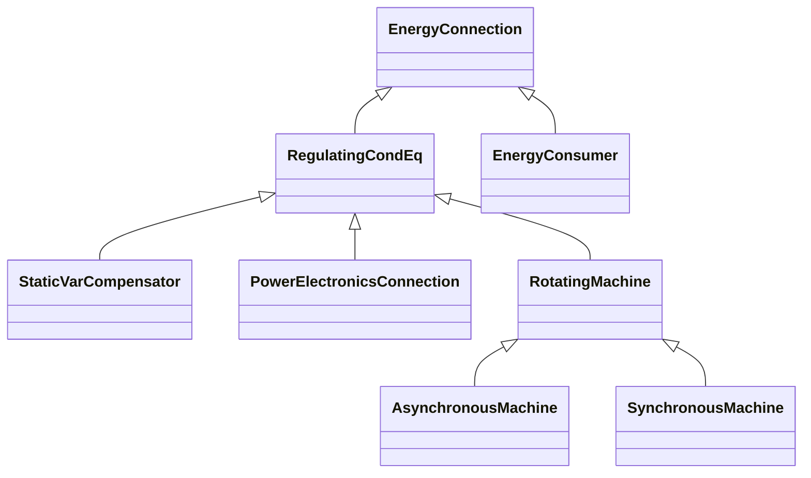

# Package_Wires

## Overview Diagram

<button class="mermaid-enlarge-button">Enlarge Diagram</button>

## Classes

- [AsynchronousMachine](../Classes/AsynchronousMachine): A rotating machine whose shaft rotates asynchronously with the electrical field.
- [EnergyConnection](../Classes/EnergyConnection): A connection of energy generation or consumption on the power system model.
- [EnergyConsumer](../Classes/EnergyConsumer): Generic user of energy - a point of consumption on the power system model.
- [PowerElectronicsConnection](../Classes/PowerElectronicsConnection): A connection to the AC network for energy production or consumption that uses power electronics rather than rotating machines.
- [RegulatingCondEq](../Classes/RegulatingCondEq): A type of conducting equipment that can regulate a quantity (i.
- [RotatingMachine](../Classes/RotatingMachine): A rotating machine which may be used as a generator or motor.
- [StaticVarCompensator](../Classes/StaticVarCompensator): A facility for providing variable and controllable shunt reactive power.
- [SynchronousMachine](../Classes/SynchronousMachine): An electromechanical device that operates with shaft rotating synchronously with the network.
